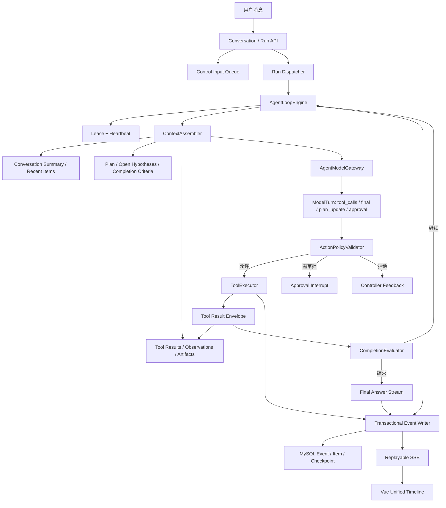

# CyberGuard 代码漏洞审查 Agent 底层改造规格说明

> 文档版本：1.3.0
> 冻结日期：2026-08-16
> 修订记录：
> - v1.3.0（2026-08-16，实施与验收补充）：补齐 `unsafe_runtime_configuration` 受限审计技能与配置证据角色；V3 前端以真实 Provider 调用数替代旧 Loop 零轮次误导；真实浏览器验证桌面、平板和手机断点，平板顶部导航在 `<=1200px` 收起，避免逐字压缩。
> - v1.2.0（2026-08-16，用户已确认）：Harness V3 增加 Provider 明确返回的原始 reasoning 实时展示例外；仅限任务发起人的活动 SSE 订阅，瞬时传输、不落库、不回放；隐藏 Chain-of-Thought 与 ToT 仍不实现。
> - v1.1.0（2026-08-12，用户拍板）：reasoning 展示策略修订——不展示、不持久化**完整原始思维链全文**；允许展示与持久化**模型真实 reasoning 输出经脱敏限长的受限摘要（Reasoning Summary）**，以 Codex 风格按 sequence 进入统一时间线。
> 适用仓库：`D:\workproject\work\work-5238`
> 文档关系：本文件定义“做成什么”；`tasks.md` 定义“按什么顺序做”；`checklist.md` 定义“凭什么算完成”。
> 执行对象：后续接手本项目的一个或多个编码 Agent。
> 本轮状态：第 25 节的核心 V3 纵向切片已实施并完成授权真实浏览器验收；已知漏洞/安全对照夹具与完整开关回滚演练仍是未完成发布门禁。

---

## 0. 强制执行说明

### 0.1 执行前必须阅读

后续 Agent 在写代码前必须依次阅读并遵守：

1. `D:\workproject\work\work-5238\AGENTS.md`
2. `D:\workproject\work\work-5238\CLAUDE.md`
3. `D:\workproject\work\work-5238\.claude\rules\git-commit-conventions.md`
4. `D:\workproject\work\work-5238\.claude\rules\modular-architecture-and-reuse.md`
5. `D:\workproject\work\work-5238\agent-redesign\spec.md`
6. `D:\workproject\work\work-5238\agent-redesign\tasks.md`
7. `D:\workproject\work\work-5238\agent-redesign\checklist.md`

若仓库实际代码与本文冲突，执行 Agent 不得自行猜测或静默偏离；应在当批次任务记录中列出冲突、证据、最小修订建议，再继续实施。

### 0.2 工作区保护

截至 2026-08-12，本仓库存在大量未提交改动，其中包含正在开发的 Agent Chat、LLM 分析与工具事件改动。后续 Agent 必须：

- 开始每个批次前执行 `git status --short --branch` 和目标文件 `git diff`。
- 不得执行 `git reset`、`git clean`、rebase、强推或覆盖用户未提交内容。
- 不得读取或输出 `backend/.env`、Token、密钥、日志原文、上传项目源码全文或构建产物。
- 若目标文件已有用户改动，必须在其基础上最小增量修改；无法安全拆分时先报告冲突。
- 不执行、构建、安装、导入或运行被审查项目的任何代码；Agent 工具只能在 CyberGuard 已授权的不可变快照上做受限静态读取和确定性分析。

### 0.3 完成声明

任何 Agent 都不得只凭“代码看起来正确”“单测通过”宣称项目改造完成。最终完成至少需要：

- 数据库迁移在授权的本机数据库实际应用；
- 后端 focused tests、Agent 全量 tests、后端全量 tests 通过；
- 前端生产构建通过；
- 后端由用户重启后，真实浏览器完成一次多轮、至少三次工具调用、一次策略调整的审查流程；
- SSE 实时顺序、刷新重放顺序、数据库事件顺序三者一致；
- 至少一个真实已配置 Provider 的工具调用闭环通过；若用户未授权真实 Provider，则只能标记为“代码完成，真实 Provider 门禁未完成”。

---

## 1. 背景与问题定义

### 1.1 当前系统的准确定位

当前 CyberGuard 已拥有较完整的 Agent Runtime 外壳：

- `AgentRun / AgentPlan / AgentPlanNode / AgentPlanEdge`
- `AgentStepExecution / AgentToolCall / AgentCheckpoint / AgentEvent`
- Conversation / Turn / Approval / Observation / Budget / Cost
- Planner、Replanner、Provider Router、工具注册表、SSE 重放、Watchdog
- 前端 Agent 工作台、计划图、工具列表、决策记录和 Chat 页面雏形

但核心执行仍是“LLM 先生成一次计划，Runner 顺序跑预定义节点，最后再调用一次 LLM 写总结”。它是**带 LLM 规划和规则重规划的持久化工作流**，还不是目标中的**模型在环、多轮观察驱动 Agent**。

### 1.2 已确认的关键缺口

1. **模型不在循环内**：工具结果不会在每次调用后回送给模型决定下一步。
2. **计划 DAG 未按依赖调度**：Runner 目前按数据库 ID 排序执行节点，未真正检查依赖是否满足。
3. **Provider 契约仅支持文本**：缺少标准化 `messages / tools / tool_choice / tool_calls / tool_result`。
4. **多轮只存在于数据库和 UI**：Planner/分析主要读取当前输入，没有统一的 Conversation Context Pack。
5. **活跃任务追加消息会直接触发规则 Replanner**：不是向运行循环投递有序控制输入。
6. **前端不是事件源时间线**：一个 Agent 气泡中固定渲染“思考 → 全部工具 → 最终分析”，无法按真实时间交错。
7. **最终回答不是统一增量事件**：缺少 `assistant.message.delta` 与完整的 Item 生命周期。
8. **推理边界冲突（v1.1 已修订）**：设计、Redactor、实现和用户未提交改动对 reasoning 展示与持久化互相矛盾；已统一为"受限 Reasoning Summary 可展示、可持久化，完整原始思维链全文不落库、不进日志与审计"。
9. **完成语义错误风险**：失败节点不属于 unfinished 集合，可能被标记为 `completed`。
10. **工具治理只声明未落实**：Input Schema、超时、审批、重试、取消和风险等级没有统一强制执行。
11. **事件序列存在并发窗口**：`MAX(sequence)+1` 在多写入方场景下可能冲突。
12. **Snapshot + SSE 水位不原子**：刷新时可能漏事件、重复事件或触发无效 Gap。
13. **Lease/Heartbeat 有字段但未成为运行不变量**：恢复和 Watchdog 还没有与每轮 Agent Loop 严密衔接。
14. **运行模式语义不完整**：`baseline / hybrid / deep_audit` 没有严格映射到不同自治级别。
15. **事件 Warning 与 Run Warning 可能分离**：最终状态和观察面板不一定反映真实警告。

### 1.3 改造目标

将现有系统改造成一个**受治理的混合式安全审查 Agent（Governed Hybrid Security Agent）**：

```text
用户输入
→ 意图与约束解析
→ 上下文组装
→ 模型提出下一动作或最终回答
→ 控制器进行策略/权限/预算/Schema 校验
→ 执行一个或多个受控工具
→ 生成结构化 Observation
→ 将 Observation 回送模型
→ 模型继续、调整计划、请求审批或结束
→ 控制器验证完成条件
→ 流式输出最终说明
```

关键原则：**模型选择路线，控制器掌握权限、边界、预算、状态和完成判定。**

---

## 2. 权威参考与复刻策略

本项目不整体 Fork 任何单一框架，而是复刻经过验证的设计模式：

| 参考作品 | 学习内容 | 不直接复制的内容 |
|---|---|---|
| OpenHands Software Agent SDK | Agent Loop、Action/Observation、事件流、上下文压缩、Provider 中立工具策略 | Shell、写文件、执行项目代码等高权限工具 |
| OpenAI Codex App Server | Thread → Turn → Item 协议、`item/started` / delta / completed、统一时间线 | 与 Codex CLI/Rust Runtime 的强绑定及其宽工具权限 |
| OpenAI Agents SDK | Runner 循环、Tool Call → Tool Result → 再调用模型、Streaming Run Items、Guardrail/Approval | 只绑定 OpenAI Provider 的实现方式 |
| LangGraph | Checkpoint、Interrupt、Resume、幂等 Durable Execution、故障恢复语义 | 当前阶段不引入第二套图运行时和第二事实源 |
| Anthropic Building Effective Agents | Workflow 与 Agent 的边界、简单可组合模式、由模型动态决定过程和工具 | 无治理的开放式自治循环 |
| Manus | 任务规划、执行中可暂停重规划、用户确认后执行、实时进度与完整交付体验 | 其通用计算机、浏览器、安装软件和文件写入等宽权限能力 |
| Anthropic Claude Code Security Review | 高置信 Finding、证据优先、假阳性过滤、Diff 范围聚焦 | 对不可信项目开放执行能力，或把提示词注入风险留给用户承担 |
| Qodo Code Review v2 / PR-Agent | 仓库上下文、规则系统、专项审查、结果优先级和低噪声输出 | 首阶段直接引入多 Agent 复杂度，或把 PR Review 工作流当作完整 Runtime |

复刻组合冻结为：

- **OpenHands 风格循环**；
- **Codex 风格事件与前端 Item 时间线**；
- **LangGraph 风格持久化/恢复语义，但复用现有 MySQL 模型**；
- **Manus 风格可审阅计划、执行中重规划与真实进度体验**；
- **Anthropic/Qodo 风格证据验证、高置信与低噪声输出**；
- **CyberGuard 自身确定性扫描、RAG、权限、审批、安全边界作为不可绕过控制层**。

官方资料入口（已于 2026-08-12 复核）：

- OpenHands SDK 架构：<https://docs.openhands.dev/sdk/arch/sdk>
- OpenHands SDK 仓库：<https://github.com/OpenHands/software-agent-sdk>
- OpenAI Codex App Server Protocol：<https://github.com/openai/codex/blob/main/codex-rs/app-server/README.md>
- OpenAI Agents SDK：<https://openai.github.io/openai-agents-python/running_agents/>
- LangGraph Persistence：<https://docs.langchain.com/oss/python/langgraph/persistence>
- LangGraph Interrupts：<https://docs.langchain.com/oss/python/langgraph/interrupts>
- Anthropic Building Effective Agents：<https://www.anthropic.com/engineering/building-effective-agents>
- Manus 产品定义：<https://manus.im/docs/introduction/welcome>
- Manus Plan Mode：<https://manus.im/blog/manus-plan-mode>
- Anthropic Claude Code Security Review：<https://github.com/anthropics/claude-code-security-review>
- Qodo Code Review：<https://docs.qodo.ai/code-review>
- 开源 PR-Agent：<https://github.com/The-PR-Agent/pr-agent>

---

## 3. 范围与非目标

### 3.1 本次必须完成

- 模型在环的多迭代 Agent Loop。
- Provider 中立的 Tool Calling 契约与 OpenAI-compatible Adapter。
- 工具调用结果作为下一轮模型输入。
- 真正按依赖执行的计划 DAG。
- 统一 Conversation Context Pack 与压缩摘要。
- 活跃运行中的用户消息成为有序控制事件。
- Durable Checkpoint、Lease、Heartbeat、Pause/Resume/Approval Continuation。
- 统一、持久、可重放的 Item Event Protocol。
- 前端严格按 `sequence` 渲染真实时间线。
- Assistant 最终消息增量流。
- 工具 Schema、权限、风险、预算、审批、超时、重试、取消强制执行。
- 正确的完成/警告/部分/失败状态。
- 兼容现有扫描、观察、修复建议、成本、Provider Policy、运维面板。
- 完整迁移、测试、浏览器验收和运维说明。

### 3.2 明确非目标

- 不让 Agent 执行被扫描项目、安装依赖或运行测试。
- 不允许任意 Shell、任意文件写入、任意网络请求。
- 不自动应用、提交、推送修复补丁。
- 不向用户展示或持久化完整原始模型思维链全文（raw chain-of-thought）；只允许经脱敏、限长并标注敏感等级的 Reasoning Summary。
- 不在本阶段引入 LangGraph/CrewAI/AutoGen 等新 Runtime 依赖。
- 不重写现有扫描器、风险评分、图谱和 RAG 核心。
- 不为了“像 Agent”而加入假的延时、假的思考文案或前端模拟事件。
- 不删除旧 API；迁移期必须提供兼容层和弃用路径。

---

## 4. 术语与系统不变量

### 4.1 术语

- **Conversation**：围绕一个项目安全目标的长期会话。
- **Turn**：一次用户输入及其对应的执行周期。
- **Run**：一个 Turn 的可恢复后台运行实例。
- **Iteration**：模型观察上下文、作出一次下一动作决策的循环次数。
- **Item**：用户消息、计划、决策摘要、工具调用、Observation、审批、助手消息等可呈现对象。
- **Event**：Item 生命周期或 Run 状态变化的有序事实。
- **Action**：模型输出的 `tool_calls / final_answer / request_approval / revise_plan / ask_user` 之一。
- **Observation**：工具执行后返回给模型的结构化、受限、可审计结果。
- **Decision Summary**：可展示、可持久化的简洁决策理由，不是隐藏思维链。
- **Reasoning Summary**：模型真实 reasoning 通道（`reasoning_content` / 流式 `reasoning_delta`）输出的受限摘要，经脱敏、限长并标注敏感等级后可作为 Item 进入统一时间线；它是真实思考内容的摘要，不是伪造文案，也**不是完整原始思维链全文**。
- **Controller**：Agent Loop 的确定性治理层。

### 4.2 不变量

1. 每次状态变化、Item 生命周期变化和控制输入必须有单调递增 `sequence`。
2. 前端只能按事件序列呈现，不得按组件类型重排。
3. 同一个 Tool Call 只能执行一次；恢复只能重放已完成结果或安全重试。
4. 模型不能绕过 Tool Registry、Workspace 鉴权、快照边界和预算。
5. 原始 Prompt、原始源码全文、Token、Cookie、密钥和完整原始思维链全文不得进入普通日志或审计；Reasoning Summary 必须脱敏、限长并标注敏感等级后才允许进入事件流、UI 与持久化。
6. 每个最终 Finding/Observation 必须能回溯到代码位置、确定性 Finding、Artifact 或可信 Citation。
7. 失败的强制基线节点不允许 `completed`。
8. 任何终态都必须由 Completion Evaluator 产生，Runner 不得自行“全部循环跑完即成功”。
9. Snapshot 响应必须带一个与内容一致的事件水位；SSE 从该水位之后继续。
10. 运行恢复后必须保持相同 `conversation_id / turn_id / run_id / snapshot_id / policy snapshot / provider policy snapshot`。

---

## 5. 目标总体架构



### 5.1 组件职责

| 组件 | 职责 | 禁止承担 |
|---|---|---|
| `AgentLoopEngine` | 一次只推进一个安全状态，协调上下文、模型、工具、完成判定 | 直接拼 Prompt、直接操作 ORM 大查询、直接渲染文案 |
| `ContextAssembler` | 生成受限 `AgentContextPack` | 调用工具、改变 Run 状态 |
| `AgentModelGateway` | Provider 路由、Tool Calling 适配、标准化 ModelTurn | 业务授权和工具执行 |
| `ActionPolicyValidator` | Tool Allowlist、Schema、风险、审批、预算、模式检查 | 执行工具 |
| `PlanScheduler` | 依赖解析、READY/BLOCKED/SKIPPED 计算 | 调用模型或工具 |
| `ToolExecutor` | 幂等执行、超时、取消、重试、结果落库 | 自行决定下一工具 |
| `CompletionEvaluator` | 校验完成条件和终态 | 生成安全 Finding 内容 |
| `EventWriter` | 分配序列并原子持久化 Event/Item 状态 | 包含源码、Prompt 或完整原始思维链全文 |
| `Timeline Reducer` | Snapshot + Event 归并、Gap 检测、按 sequence 展示 | 按“思考/工具/答案”类型重新分组 |

---

## 6. Agent Loop 详细设计

### 6.1 单次推进算法

```python
while not terminal:
    acquire_or_refresh_lease(run)
    apply_pending_control_inputs(run)
    enforce_pause_cancel_deadline_budget(run)

    context = context_assembler.build(run, turn)
    model_turn = model_gateway.next_turn(context, tool_catalog)
    persist_model_turn_items(model_turn)

    if model_turn.kind == "tool_calls":
        for call in policy_validator.validate_and_schedule(model_turn.tool_calls):
            result = tool_executor.execute(call)
            persist_tool_result(result)
        checkpoint(run)
        continue

    if model_turn.kind == "plan_update":
        validate_and_persist_plan_version(model_turn.plan_update)
        checkpoint(run)
        continue

    if model_turn.kind == "request_approval":
        persist_approval_and_interrupt(run)
        return

    if model_turn.kind == "ask_user":
        persist_question_and_interrupt(run)
        return

    if model_turn.kind == "final_answer":
        verdict = completion_evaluator.evaluate(run, model_turn)
        if verdict.accepted:
            stream_and_persist_final_answer(model_turn)
            finalize_run(verdict)
            return
        append_controller_feedback(verdict.missing_requirements)
        checkpoint(run)
```

### 6.2 循环边界

默认配置建议：

| 限制 | 默认值 | 说明 |
|---|---:|---|
| `max_iterations` | 20 | 每次模型决策算一轮 |
| `max_tool_calls` | 30 | 沿用 Run Budget，可按模式覆盖 |
| `max_consecutive_model_errors` | 2 | 超过后显式降级或部分完成 |
| `max_same_tool_same_args` | 2 | 防止死循环 |
| `max_plan_versions` | 5 | 包含初始计划 |
| `max_context_chars` | 60000 | 具体还应受模型 token 限制 |
| `max_tool_result_chars_per_call` | 12000 | 超出存 Artifact，模型只收摘要与引用 |
| `lease_seconds` | 60 | Worker 必须周期续租 |
| `heartbeat_seconds` | 15 | 每轮、长工具进度时刷新 |

所有限制必须配置化、记录在 Run Policy Snapshot 中，并由测试覆盖。

### 6.3 运行模式语义

| 模式 | 模型自治 | 强制工具 | 允许动作 | 结束要求 |
|---|---|---|---|---|
| `baseline` | 无或极低 | inventory、baseline scan、coverage、risk、report | 控制器固定 DAG；模型仅可生成最终摘要 | 确定性基线完整 |
| `hybrid` | 中 | baseline 全部 | 模型可在基线后选择受控检索、图谱、代码切片、Deep Review | 基线完整 + 用户目标已回答 |
| `deep_audit` | 高但受治理 | baseline 全部 | 模型可多轮调用敏感读取、图谱和 Deep Review；受预算/审批约束 | 覆盖、证据和停止原因明确 |

`baseline` 是可靠降级路径，不得伪装成模型自主 Agent；UI 必须显示“策略工作流”或“模型在环”。

### 6.4 模型动作契约

每一轮模型只能返回下列标准化类型之一：

```text
ToolCallsAction
PlanUpdateAction
RequestApprovalAction
AskUserAction
FinalAnswerAction
```

禁止模型直接返回“执行成功”并绕过 Completion Evaluator。

`ToolCallsAction` 最多包含 3 个相互独立、均为只读且策略允许的调用；存在依赖关系时必须拆成后续轮次，确保 Observation 真正影响下一动作。

---

## 7. Provider 中立 Tool Calling 契约

### 7.1 新请求契约

保留现有 `LLMRequest` 供 QA/RAG 等文本场景使用；新增 Agent 专用契约，避免破坏旧调用方：

```python
@dataclass(frozen=True)
class AgentModelRequest:
    messages: tuple[AgentModelMessage, ...]
    tools: tuple[AgentToolDefinition, ...]
    tool_choice: str | dict | None
    temperature: float
    max_tokens: int
    timeout_seconds: float | None
    metadata: dict[str, Any]

@dataclass(frozen=True)
class AgentModelMessage:
    role: Literal["system", "user", "assistant", "tool"]
    content: str | None
    tool_calls: tuple[AgentModelToolCall, ...] = ()
    tool_call_id: str | None = None

@dataclass(frozen=True)
class AgentModelToolCall:
    call_id: str
    name: str
    arguments: dict[str, Any]

@dataclass(frozen=True)
class AgentModelResponse:
    content: str | None
    tool_calls: tuple[AgentModelToolCall, ...]
    finish_reason: str | None
    provider_name: str
    model: str | None
    usage: dict[str, Any]
    warning_code: str | None
```

### 7.2 流式契约

```python
@dataclass(frozen=True)
class AgentModelStreamEvent:
    event_type: Literal[
        "output_text_delta",
        "tool_call_started",
        "tool_call_arguments_delta",
        "tool_call_completed",
        "usage",
        "completed",
        "failed",
    ]
    item_id: str | None
    call_id: str | None
    delta: str
    payload: dict[str, Any]
```

### 7.3 Provider 能力

`ProviderCapabilities` 至少包含：

- `supports_native_tools`
- `supports_streaming`
- `supports_parallel_tool_calls`
- `supports_reasoning_tokens_usage`
- `max_context_tokens`
- `max_output_tokens`
- `supports_json_schema`

### 7.4 适配策略

1. Provider 原生支持工具：使用原生 `tools` 和 `tool_calls`。
2. Provider 不支持原生工具但支持 JSON：使用严格 Action Envelope + Parser + 一次修复。
3. 两者均不可靠：降级 `baseline`；不得用正则从自由文本中猜工具名。
4. Provider Failover 后必须保留完整标准化上下文，并发出 `strategy.provider_switched`。

### 7.5 日志边界

- 禁止 `_raw_log` 输出原始 Provider 响应。
- 禁止日志记录 Prompt、源码切片、Tool Result 正文、Authorization、Cookie 或完整原始 reasoning。
- 允许：Provider、模型、Operation、Token、延迟、状态、Warning Code、输入输出 Digest、Tool 名称、受限摘要和 Reasoning Summary 摘要。

---

## 8. Context Pack 与多轮记忆

### 8.1 `AgentContextPack`

```json
{
  "schema_version": 1,
  "conversation": {
    "conversation_id": 1,
    "turn_id": 7,
    "run_id": 9,
    "snapshot_id": 3,
    "mode": "hybrid"
  },
  "goal": "重点检查鉴权与越权",
  "constraints": [],
  "conversation_summary": "受限摘要",
  "recent_messages": [],
  "plan": {
    "version": 2,
    "objective": "...",
    "open_hypotheses": [],
    "completion_criteria": []
  },
  "completed_actions": [],
  "recent_observations": [],
  "available_artifacts": [],
  "pending_approvals": [],
  "budgets": {},
  "controller_feedback": [],
  "tool_catalog_digest": "sha256"
}
```

### 8.2 上下文优先级

从高到低：

1. 系统安全边界和不可绕过基线；
2. 当前用户目标、当前控制输入、审批结果；
3. 当前计划、未完成条件、开放假设；
4. 最近 Tool Result 和 Observation；
5. 已确认 Finding、Artifact、引用；
6. Conversation Summary；
7. 最近若干用户/助手消息；
8. 历史低价值事件摘要。

### 8.3 压缩规则

- 不能把完整历史 Event、完整源码、完整 Tool Result 每轮塞给模型。
- 达到上下文阈值时生成结构化 `ConversationSummary`，包含：目标、已验证事实、未解决问题、已拒绝假设、重要文件/符号、预算和审批状态。
- 摘要必须带 `source_sequence_from / source_sequence_to / summary_version / digest`。
- 摘要不能替代权威 Finding、Observation、Approval、Tool Result；这些仍通过 ID/Artifact 引用。
- 摘要生成失败时缩短 Recent Window 并发出 `AGENT_CONTEXT_LIMITED`，不得静默丢关键约束。

### 8.4 用户在运行中追加消息

不得在 HTTP 请求线程直接创建新计划并执行。必须：

1. 幂等写入 `AgentConversationMessage`；
2. 写入 `AgentControlInput(type=user_message)`；
3. 分配与 Run 相同序列域中的事件；
4. 唤醒/入队原 Run；
5. Loop 在安全边界读取该输入；
6. 模型结合当前 Observation 决定更新计划、继续或询问用户；
7. 标记 Control Input 为 `applied`。

---

## 9. 计划与 DAG 调度

### 9.1 计划的角色

计划不是“一次性待办数组”，而是可版本化的高层意图与强制基线图。模型每次仍可依据 Observation 选择下一安全动作，但不得执行不满足依赖的节点。

### 9.2 节点状态规则

- `PENDING`：依赖尚未评估。
- `READY`：所有成功依赖已满足。
- `RUNNING`：唯一 Worker 已取得执行权。
- `SUCCEEDED`：产出有效 Tool Result。
- `FAILED`：调用已失败且不再重试。
- `BLOCKED`：前置失败或审批未通过，不能执行。
- `SKIPPED`：条件不满足且属于合法跳过。
- `CANCELED`：用户取消。
- `SUPERSEDED`：新计划版本替代。

### 9.3 调度不变量

- 只能执行 `READY` 节点。
- `SUCCESS` 边要求上游 `SUCCEEDED`。
- 上游 `FAILED` 时，下游默认 `BLOCKED`，除非存在显式 Failure/Always 边；本改造第一阶段可继续只支持 Success 边，但运行时必须正确 Block。
- Plan Version 切换后，旧版本未开始节点标记 `SUPERSEDED`；已完成结果通过 Artifact/Observation 引用复用。
- 不得仅按 ID 或数组顺序执行。
- 计划验证必须检查 Tool Schema、模式允许范围、强制基线节点、循环、深度、节点数量和预算预估。

### 9.4 计划更新

模型可以提出 Plan Patch，但 Controller 才能：

- 合并不可绕过基线；
- 验证新增节点；
- 生成新 Plan Version；
- 写 Decision Record；
- 发出 `plan.updated`；
- 保留旧版本只读可追溯。

---

## 10. 工具执行与治理

### 10.1 Tool Descriptor 必填字段

- `name / version / category / description`
- `input_schema`
- `risk_level`
- `timeout_seconds`
- `idempotent`
- `requires_approval`
- `retry_policy`
- `allowed_modes`
- `produces_artifact_types`
- `result_schema_version`

### 10.2 执行顺序

```text
解析 Tool Call
→ 工具存在性检查
→ 模式与 Workspace Policy 检查
→ JSON Schema/Marshmallow 边界校验
→ 快照/对象级权限检查
→ 风险与审批检查
→ 预算预留
→ 幂等键检查
→ 超时/取消包装执行
→ 结果 Schema 校验与脱敏
→ ToolResult/Artifact/Observation 持久化
→ 预算结算
→ Event + Checkpoint
```

### 10.3 超时与取消

- 工具 Handler 继续通过 `ctx.cancelled()` 主动轮询。
- Executor 必须有硬截止时间；线程模式无法安全中止的工具必须自身支持 Deadline，超时后结果不得再写入成功状态。
- 长工具每 5~10 秒刷新 Heartbeat，并可发 `tool.call.progress`，Payload 只能是数字进度和安全摘要。
- 取消后不得启动新工具；正在运行的工具完成后结果标记 canceled/ignored，不能推动计划成功。

### 10.4 重试

仅在以下全部成立时自动重试：

- Descriptor `idempotent=True`；
- Result `retryable=True`；
- Warning/Error 在允许列表；
- 未超过 Tool Retry、Run Budget 和 Wall Clock；
- 没有用户取消、暂停或新审批要求。

重试必须使用新的 Attempt，但保持逻辑 Call/Node 关联，退避并记录原因。

### 10.5 Tool Result Envelope

```json
{
  "schema_version": 1,
  "call_id": "provider-call-id",
  "tool_call_id": 123,
  "tool_name": "read_code_slice",
  "status": "succeeded",
  "summary": "读取 app/auth.py 第 20-80 行",
  "structured": {},
  "artifact_refs": [],
  "observation_refs": [],
  "warning_codes": [],
  "error_code": null,
  "retryable": false,
  "truncated": false
}
```

模型只接收该受限 Envelope；大内容必须进入 Artifact，并以 ID、Digest、范围和摘要引用。

---

## 11. 完成判定与最终状态

### 11.1 `CompletionEvaluator`

输入：

- 当前目标与完成条件；
- 强制基线节点状态；
- 用户要求覆盖范围；
- Finding/Observation 证据状态；
- Tool/LLM/预算/审批结果；
- 模型提出的 Final Answer。

输出：

```json
{
  "accepted": true,
  "terminal_status": "completed_with_warnings",
  "missing_requirements": [],
  "warning_codes": [],
  "completion_reason": "..."
}
```

### 11.2 状态规则

- `completed`：所有强制条件满足，无警告、无失败、无证据缺口。
- `completed_with_warnings`：目标满足，但存在已知降级、可接受工具失败、Provider Failover 或引用缺口。
- `partial`：已产出有用结果，但用户目标或强制条件未完全满足；必须说明缺什么。
- `failed`：无法产出可信结果，或强制基线失败且无安全降级。
- `canceled`：用户取消。

任何 `FAILED/BLOCKED` 强制节点都不能得到 `completed`。

### 11.3 最终回答结构

最终回答至少包含：

1. 审查目标与范围；
2. 实际执行过的工具和覆盖；
3. 高置信漏洞/风险摘要；
4. 证据与引用；
5. 被排除或未验证内容；
6. 降级、警告、预算/审批影响；
7. 建议的下一步；
8. 明确说明系统未执行项目代码、未自动应用修复。

最终回答必须通过 `assistant.message.delta` 流式输出，并以 `assistant.message.completed` 固化。

---

## 12. Reasoning、Reasoning Summary、Decision Summary 与安全边界

> 本节的冻结规则适用于 baseline/V1/V2。Harness V3 对“Provider 明确返回的原始
> reasoning”增加了 §25.3 的严格实时例外，但不放宽隐藏 Chain-of-Thought 禁止展示、
> 不持久化、不回放，也不改变受控 Reasoning Summary 的历史契约。

### 12.1 冻结决策（v1.1 修订：用户拍板采用 Codex 式受限推理摘要）

**不展示、不持久化、不重放模型完整原始隐藏思维链全文（raw chain-of-thought 逐 token 文本）。**

允许展示与持久化的是：

- `intent.summary`
- `plan.created / plan.updated`
- `decision.summary`
- `reasoning.summary`（**Reasoning Summary**：模型真实 reasoning 通道输出的受限摘要）
- `controller.feedback`
- 工具调用与 Observation
- 最终回答

Reasoning Summary 的来源必须是模型真实输出（provider 的 `reasoning_content` / 流式 `reasoning_delta`），经 `redact_reasoning` 脱敏、限长截断并标注 `sensitive_level` 后进入统一时间线；它不是静态占位文案，也不得包含完整原始思维链全文。示例（模型真实推理输出的受限摘要）：

> "先核对扫描证据，再按调用链定位入口……"

在 baseline/V1/V2 路径中，原始 reasoning 全文只在进程内存中瞬时累积用于生成摘要，
流结束后必须丢弃；不得写入数据库、日志、审计或 API 原文。V3 的 Provider 原始 reasoning
实时例外必须遵守 §25.3 的瞬时中继、创建者鉴权和不可回放约束。

### 12.2 对现有实现的要求（v1.1 修订）

- `llm.reasoning_delta` / `llm_reasoning` 协议演进为 v2 `item.reasoning_summary.*`；旧事件迁移期可解析并作为 legacy 推理摘要展示，不再新增旧格式。
- 用户未提交改动中把 `llm_reasoning` 写入 `AgentMessage` 的行为**保留并收紧**：只允许写入脱敏、限长（`REASONING_SUMMARY_MAX_CHARS`，默认 6000）的受限摘要，消息/Item 必须标注 `sensitive_level`；完整原始思维链全文不落库。
- `reasoning_tokens` 仅作为 Usage 数字保留。
- `internal_reasoning_boundary.py` 保持隐藏推理与可见文本隔离；baseline/V1/V2 的原始
  reasoning 只用于进程内生成摘要，不持久化；V3 Provider 原始 reasoning 只能按 §25.3
  经过瞬时中继，不得进入持久层。
- `redactor.py` 的 `redact_reasoning` 成为 Reasoning Summary 入库/入 SSE 前的强制门禁；不可安全脱敏的 delta 直接丢弃。
- 前端组件命名从 `Thinking` 迁移为 `ReasoningSummary` / `DecisionSummary`，UI 明确标注“推理摘要”，不得伪装成完整思维链。

---

## 13. Durable Item/Event Protocol

### 13.1 事件 Envelope v2

```json
{
  "event_id": 9001,
  "sequence": 42,
  "schema_version": 2,
  "conversation_id": 5,
  "turn_id": 8,
  "run_id": 13,
  "iteration": 4,
  "item_id": "toolcall_01J...",
  "parent_item_id": "modelturn_01J...",
  "event_type": "item.tool_call.completed",
  "state_version": 11,
  "occurred_at": "2026-08-12T10:00:00Z",
  "trace_id": "...",
  "payload": {}
}
```

### 13.2 Item 类型

- `user_message`
- `intent_summary`
- `plan`
- `decision_summary`
- `reasoning_summary`
- `tool_call`
- `tool_result`
- `observation`
- `approval`
- `assistant_message`
- `controller_feedback`
- `warning`

### 13.3 事件类型

建议冻结为：

```text
run.created
run.state.changed
run.completed
run.failed
run.canceled

item.user_message.created
item.intent.completed
item.plan.created
item.plan.updated
item.decision.created
item.reasoning_summary.started
item.reasoning_summary.delta
item.reasoning_summary.completed
item.reasoning_summary.failed
item.controller_feedback.created

item.tool_call.started
item.tool_call.arguments.delta        # 仅当 Provider 原生流式提供且已校验可安全展示
item.tool_call.completed
item.tool_call.failed
item.tool_result.created
item.observation.created

item.approval.requested
item.approval.resolved

item.assistant_message.started
item.assistant_message.delta
item.assistant_message.completed
item.assistant_message.failed

budget.updated
strategy.provider_switched
warning.raised
checkpoint.created
heartbeat
```

`item.reasoning_summary.delta` 只承载脱敏后的受限摘要增量，单 Item 累计不超过 `REASONING_SUMMARY_MAX_CHARS`；`llm.reasoning_delta` 为迁移期只读兼容事件，不再新增。

### 13.4 Item 生命周期

- `started` 创建可见占位 Item；
- `delta` 只更新同一个 Item；
- `completed/failed` 冻结 Item；
- 事件可重放，但 Reducer 必须幂等；
- Tool Result 和 Observation 必须出现在对应 Tool Call 之后；
- Final Assistant Message 必须出现在最后一次 Completion Decision 之后。

### 13.5 序列分配

禁止继续使用无锁 `MAX(sequence)+1` 作为唯一方案。必须选用一种事务安全实现：

- 推荐：对 `agent_runs` 行 `SELECT ... FOR UPDATE`，读取并递增 `last_event_sequence`，同事务插入 Event；
- 或使用专用 Sequence Row 原子 `UPDATE ... SET value = LAST_INSERT_ID(value + 1)`；
- SQLite 测试环境需提供等价串行化策略。

State Transition、Item 更新、Event 插入和 Checkpoint 水位必须尽量处于同一事务边界。

### 13.6 Snapshot + SSE

`GET /agent-runs/{id}` 返回：

- `snapshot_watermark`
- `run / plan / items / approvals / costs / summary`
- 所有内容必须是该水位的一致视图

前端只从 `Last-Event-ID = snapshot_watermark` 连接 SSE。若服务端检测历史已归档或客户端水位过旧，返回 `AGENT_SSE_REPLAY_GAP`，前端重新拉 Snapshot。

### 13.7 Heartbeat

- SSE Heartbeat 使用正式事件或客户端能够识别的 Keepalive 回调，不能只发被 Parser 忽略的注释。
- 首个成功响应/事件后连接状态必须变为 `connected`。
- Heartbeat 不进入用户时间线，但更新连接健康状态。

---

## 14. 数据模型与迁移

### 14.1 加性迁移

下一迁移号以实施时仓库实际最大编号为准；当前预期从 `035` 开始。必须同时：

- 新增 `database/migrations/<NNN>_agent_loop_items.sql`；
- 更新 `database/init.sql`；
- 更新 `backend/app/scripts/apply_sql_migration.py` 的 `MIGRATION_IDS`；
- 更新 SQLAlchemy 模型导出；
- 保持 MySQL 8.0 与 SQLite 测试兼容。

### 14.2 推荐新增表

#### `agent_items`

| 字段 | 要求 |
|---|---|
| `id` | bigint PK |
| `public_id` | varchar(64)，全局唯一、前端稳定 ID |
| `conversation_id / turn_id / run_id` | FK + 索引 |
| `iteration` | int |
| `item_type` | varchar(64) |
| `status` | varchar(32) |
| `parent_item_id` | nullable FK |
| `content_redacted` | mediumtext nullable |
| `summary_json` | JSON nullable |
| `sensitive_level` | varchar(32) |
| `started_at / completed_at / created_at / updated_at` | 时间 |

#### `agent_control_inputs`

| 字段 | 要求 |
|---|---|
| `id / public_id` | PK + 唯一 ID |
| `conversation_id / turn_id / run_id` | FK |
| `input_type` | user_message / approval_result / pause / resume / cancel / system_retry |
| `client_request_id` | 幂等唯一键，作用域需包含 Run |
| `payload_json` | 受限结构化数据 |
| `status` | pending / applied / rejected / superseded |
| `applied_iteration` | nullable |
| `created_by / created_at / applied_at` | 审计 |

#### `agent_conversation_summaries`

| 字段 | 要求 |
|---|---|
| `conversation_id` | FK |
| `summary_version` | 会话内唯一 |
| `source_sequence_from / source_sequence_to` | 水位 |
| `summary_json` | 结构化摘要 |
| `content_digest` | sha256 |
| `created_at` | 时间 |

### 14.3 推荐扩展字段

#### `agent_events`

- `conversation_id`
- `turn_id`
- `iteration`
- `item_public_id`
- `parent_item_public_id`
- `dedupe_key`（必要时）

#### `agent_runs`

- `iteration_count`
- `max_iterations`
- `current_item_public_id`
- `policy_snapshot_json`
- `tool_catalog_digest`
- `context_watermark`
- `last_checkpoint_id`

#### `agent_tool_calls`

- `provider_call_id`
- `logical_call_key`
- `attempt_number`
- `arguments_digest`
- `result_schema_version`
- `retryable`
- `deadline_at`
- `item_public_id`

#### `agent_checkpoints`

- `iteration`
- `context_watermark`
- `current_item_public_id`
- `lease_owner`
- `checkpoint_digest`

### 14.4 兼容策略

- 旧 `AgentMessage` 暂时保留供旧 API 和历史数据读取；新写入以 `agent_items` 为主。
- 新 Snapshot Serializer 将旧消息转换成 Legacy Items，标注 `schema_version=1`。
- 旧 Event Type 仍可被前端 Reducer 兼容，但新 Loop 只发 v2 Item Events。
- 稳定后单独开清理任务，不在本次改造中破坏性删除旧表/字段。

---

## 15. 后端模块设计与文件边界

建议新增或拆分如下，单文件超过约 250 行且承担多职责时必须继续拆分：

```text
backend/app/services/security_agent/
├── loop/
│   ├── engine.py                  # 单步推进与循环编排
│   ├── actions.py                 # 标准化 Action 类型
│   ├── context_assembler.py       # AgentContextPack
│   ├── conversation_summary.py    # 结构化会话压缩
│   ├── completion_evaluator.py    # 终态判定
│   ├── control_inputs.py          # 有序用户/审批/取消输入
│   ├── lease_service.py           # 租约、心跳、恢复
│   └── policy.py                  # 模式与控制器策略快照
├── model/
│   ├── contracts.py               # AgentModelRequest/Response/StreamEvent
│   ├── gateway.py                 # Provider 路由与调用记录
│   ├── action_parser.py           # JSON fallback
│   └── context_renderer.py        # Provider 消息渲染
├── planning/
│   ├── scheduler.py               # DAG READY/BLOCKED
│   ├── plan_service.py            # 版本化/补丁/强制基线
│   └── completion_criteria.py
├── timeline/
│   ├── contracts.py               # Item/Event 契约
│   ├── item_service.py            # Item 生命周期
│   ├── event_writer.py            # 原子序列
│   ├── snapshot_service.py        # 一致水位快照
│   ├── serializers.py
│   └── legacy_adapter.py          # v1 只读兼容
└── tools/
    ├── validator.py               # Schema/Mode/权限
    ├── deadline.py                # Deadline/取消
    └── executor.py                # 保持执行边界，减少职责
```

现有 `runner.py` 逐步退化为兼容入口，最终只负责调用 `AgentLoopEngine.run_until_interrupt()`；不得继续把 Loop、Plan、Tool、LLM Summary、Finish 全堆在同一文件。

Route 保持薄层：解析、鉴权、调用 Service、返回安全错误。不得在 Route 中推进 Agent Loop。

---

## 16. API 设计

### 16.1 保留并演进

- `POST /api/security/projects/{project_id}/agent-runs`
- `GET /api/security/agent-runs/{run_id}`
- `POST /api/security/agent-runs/{run_id}/pause`
- `POST /api/security/agent-runs/{run_id}/resume`
- `POST /api/security/agent-runs/{run_id}/cancel`
- `GET /api/security/agent-runs/{run_id}/events`
- `GET /api/security/agent-runs/{run_id}/events/stream`
- Conversation API、Approval API、Observation API、Cost API

### 16.2 新增/调整

#### `GET /agent-runs/{run_id}`

返回 `items` 与 `snapshot_watermark`，不再要求前端自行把 messages/tool_calls/steps 拼成时间线。

#### `GET /agent-runs/{run_id}/items`

服务端分页：`after_sequence / before_sequence / page_size / item_type`。

#### `POST /agent-runs/{run_id}/control-inputs`

统一提交：

```json
{
  "client_request_id": "...",
  "type": "user_message",
  "payload": {"content": "继续检查水平越权"}
}
```

现有 Conversation Message API 内部转调此 Service，保持客户端兼容。

#### `POST /agent-runs/{run_id}/retry`

只允许重试可恢复的失败/部分 Run，创建明确 Control Input，禁止直接同步执行。

### 16.3 错误契约

```json
{
  "error": {
    "code": "AGENT_TOOL_INPUT_INVALID",
    "message": "工具参数未通过校验",
    "retryable": false,
    "trace_id": "...",
    "details": {}
  }
}
```

不得向客户端返回堆栈、原始 Provider 响应或源码内容。

---

## 17. 前端统一时间线设计

### 17.1 页面职责

`frontend/src/views/security/AgentChat.vue` 只负责：

- 路由参数；
- Conversation/Run 选择；
- 页面级加载和布局；
- 组合 Timeline、Composer、Side Panels。

复杂转换放入 Store/Composable/Feature Reducer，不在页面中继续扩张。

### 17.2 建议组件

```text
frontend/src/components/security/agent/timeline/
├── AgentTimeline.vue
├── AgentTimelineItem.vue
├── UserMessageItem.vue
├── IntentSummaryItem.vue
├── PlanItem.vue
├── DecisionSummaryItem.vue
├── ReasoningSummaryItem.vue
├── ToolCallItem.vue
├── ToolResultItem.vue
├── ObservationItem.vue
├── ApprovalItem.vue
├── AssistantMessageItem.vue
├── ControllerFeedbackItem.vue
└── TimelineSkeleton.vue
```

### 17.3 Store 状态

```js
{
  run,
  itemsById,
  itemOrder,
  lastSequence,
  snapshotWatermark,
  stateVersion,
  connectionState,
  gapDetected,
  terminal,
  approvals,
  costs
}
```

`itemOrder` 只能依据首个 Event 的 `sequence`；同一 Item 的 delta 不改变位置。

### 17.4 时间线示例

```text
10:00:00 用户：重点检查鉴权与越权
10:00:01 意图：范围=auth，模式=hybrid
10:00:02 计划 v1：先执行不可绕过基线
10:00:03 工具开始：inventory_snapshot
10:00:04 工具结果：识别 128 个文件
10:00:05 决策：先跑基线扫描，再验证鉴权入口
10:00:06 工具开始：run_baseline_scan
10:00:11 工具结果：发现 4 个高风险项
10:00:12 计划更新 v2：增加认证映射与代码切片
10:00:13 工具开始：get_authentication_map
10:00:14 工具结果：定位 3 个入口
10:00:15 决策：读取路由与权限校验切片
10:00:16 工具开始：read_code_slice
10:00:17 Observation：疑似水平越权，证据待交叉验证
10:00:18 最终回答增量……
10:00:21 完成：completed_with_warnings
```

绝不能渲染为“先把所有 Decision 放上面，再把所有 Tool 放中间”。
模型真实 reasoning 输出的受限摘要（Reasoning Summary）同样作为独立 Item 按 sequence 交错插入时间线，位置由首个 delta 事件的实际到达顺序决定。

### 17.5 SSE 客户端要求

- Parser 必须回调 Heartbeat/Keepalive。
- 收到首个有效响应或帧后设置 `connected`。
- 任意事件（包括旧 reasoning 兼容事件）都必须先执行 Gap 检测再决定是否隐藏。
- Snapshot Hydration 和 SSE 连接受同一 Generation Token 保护，避免旧请求覆盖新 Run。
- Refresh 后必须恢复相同 Item 顺序和完成文本。
- Delta 只更新目标 `item_id`，不得追加重复消息。

### 17.6 UX 与响应式

- 使用现有 `BaseIcon / BaseButton / BaseBadge / BasePanel`。
- 桌面、平板、手机三断点。
- Timeline 主列和侧边详情在平板变单列；手机侧栏为抽屉。
- 所有状态有 loading/empty/error/success。
- Tool、Plan、Observation 可折叠，默认只显示受限摘要。
- “模型在环 / 策略工作流 / 已降级 / 等待审批 / 部分完成”使用真实性标签。

---

## 18. 安全与威胁模型

| 威胁 | 控制 |
|---|---|
| Prompt Injection 指挥 Agent 调危险工具 | Tool Allowlist、系统策略优先、RAG 注入检测、Action Policy Validator |
| 模型伪造 Tool Result | 只有 Controller 可创建 `tool_result` Item；Provider 输出不可直接标记完成 |
| 路径穿越/越权读取 | 快照路径解析、Workspace 对象级鉴权、行数与文件范围限制 |
| 无限循环/成本失控 | Iteration、Tool、Token、Cost、Wall Clock、重复动作限制 |
| SSE 越权 | JWT + Workspace membership + Run object authorization |
| Event 重放错乱 | 原子序列、幂等 Reducer、Snapshot Watermark、Gap Recovery |
| 工具重复执行 | 逻辑幂等键 + Attempt + 结果重放 |
| 审批重放 | Digest、单次消费、到期、角色校验、原 Run Continuation |
| 完整原始 CoT 全文泄露 | 原始 CoT 全文不落库、不进日志/审计；只持久化脱敏限长的 Reasoning Summary；Tool Result 截断与 Artifact 权限；日志仅摘要/Digest |
| Provider 原文泄露到日志 | 删除 Raw Response 日志，结构化安全日志 |
| Worker 抢占/双执行 | Lease Owner + Expiry + 原子 Claim + Heartbeat |
| 用户追加消息与工具并发 | Control Input Queue，只在安全边界应用 |
| 假阳性进入最终报告 | Observation Validation、证据要求、Completion Evaluator、人工审核状态 |

---

## 19. 可观测性与审计

### 19.1 必须记录

- Run/Turn/Iteration/Item/Tool/LLM 的 Trace 关联；
- 状态转换与耗时；
- Tool 名称、结果状态、延迟、重试、Warning；
- Provider/Model/Token/Cost/Failover；
- Checkpoint、Lease、Heartbeat、恢复原因；
- Approval 和用户 Control Input；
- Completion Verdict。

### 19.2 禁止记录

- API Key、JWT、Cookie；
- Prompt 原文；
- Provider 原始响应；
- 完整原始 reasoning 全文（受限摘要除外）；
- 源码切片正文；
- Tool Result 大字段；
- 私有 RAG 文档正文。

### 19.3 指标

- Run 成功/警告/部分/失败率；
- 平均 Iteration、Tool Calls、Replan、成本；
- Tool 失败/超时/重试率；
- Provider Failover 率；
- SSE 重连/Gap/Resync 率；
- Approval 等待时长；
- 从用户输入到首个可见 Item/首个 Tool/最终回答的延迟。

---

## 20. 测试与验收战略

### 20.1 单元测试

- Action Parser 与 Tool Calling 标准化；
- Context Pack 裁剪和摘要；
- Plan Scheduler 的 READY/BLOCKED/SUPERSEDED；
- Tool Schema、风险、模式、审批和预算；
- Completion Evaluator 的全部终态；
- Event Reducer 的 sequence/delta/idempotency/gap；
- 隐藏 Chain-of-Thought 不落库、不进 Event、不进日志；Reasoning Summary 脱敏、限长、
  可重放且刷新回放一致。V3 Provider 原始 reasoning 的实时例外按 §25.3 单独验证，不能
  进入持久事件或历史回放。

### 20.2 集成测试

- Fake Provider：模型 → Tool Call → Tool Result → 第二轮模型 → Final；
- 至少三次交错 Tool Call；
- Tool Failure 后模型调整策略；
- Plan Update 后按依赖执行；
- 用户运行中追加消息；
- Approval Interrupt → Resolve → 同一 Run 继续；
- Pause/Resume/Cancel；
- Worker Crash → Checkpoint 恢复；
- Snapshot + SSE 无漏事件；
- 并发 Event Writer 无重复 Sequence；
- Workspace 越权全部拒绝。

### 20.3 契约测试

每个 Provider Adapter 使用录制或手写 Fake Payload 测试：

- 完整工具调用；
- 参数增量；
- 多工具调用；
- 无效 JSON；
- Provider Warning/Timeout/Rate Limit；
- Usage；
- Failover；
- 禁止真实 HTTP。

### 20.4 浏览器验收

真实验收脚本必须展示：

1. 创建会话；
2. 输入“重点检查鉴权与越权”；
3. 看到 Intent/Plan；
4. 至少三次 `Decision → Tool → Result/Observation` 交错；
5. 中途追加“再检查水平越权和管理员接口”；
6. Loop 吸收消息并调整计划；
7. 最终回答逐字/分块流式输出；
8. 刷新页面，顺序、内容、状态不变；
9. 人为断开网络再恢复，Last-Event-ID 重放无重复；
10. 另一个 Workspace 用户访问 Run 返回 404/403；
11. 数据库 Event sequence 与 UI 顺序一致；
12. 日志无 Prompt/源码/完整原始 reasoning/Token。

### 20.5 持续验证边界

当前仓库处于“无可依赖 CI”状态，且 `.github/` 被现有项目规则列为忽略路径。本改造不得静默创建或提交 CI 配置。默认启用 v2 前必须由用户明确选择：

1. 单独授权修改仓库治理规则，并增加执行后端全量、前端 Agent 测试、前端 build 和安全检查的 CI；或
2. 保持人工发布门，并在交付结论中明确“无自动合并保护/无持续集成证据”。

第二种选择不影响本地真实纵向切片的事实，但不得把交付描述为已经具备自动化合并门或持续交付能力。

---

## 21. 性能和可靠性目标

这些是本地/测试环境的工程目标，不是未经测量的承诺：

- Snapshot 接口在 1000 Items 时 P95 < 1.5 秒；
- SSE 新事件从提交到浏览器显示 P95 < 1 秒（不含模型/工具耗时）；
- Reducer 处理 5000 Events 不出现 O(n²) 明显卡顿；
- Timeline DOM 使用分页/窗口化或折叠，默认不无限渲染全部历史；
- Tool Result 大于阈值必须截断并转 Artifact；
- Worker 重启后 Open Run 能在 Watchdog/恢复命令触发下继续，不重复已完成 Tool；
- 并发 Event Writer 压测不出现重复/缺失 Sequence。

---

## 22. 迁移与发布策略

### 22.1 Feature Flag

建议配置：

- `AGENT_LOOP_V2_ENABLED=false`
- `AGENT_EVENT_SCHEMA_V2_ENABLED=false`
- `AGENT_TIMELINE_V2_ENABLED=false`

按 Workspace 或全局切换。Flag 关闭时继续旧 Runner；Flag 开启时新建 Run 使用 v2，旧 Run 仍按旧路径读取。

### 22.2 发布顺序

1. 数据模型与兼容 Serializer；
2. Event Writer v2；
3. Provider Tool Calling 契约；
4. Agent Loop + Scheduler + Tool Governance；
5. Context/Control Input/Checkpoint；
6. Timeline Store/UI；
7. 真实垂直切片；
8. 默认启用 v2；
9. 稳定观察后再规划旧协议清理。

### 22.3 回滚

- 关闭 v2 Feature Flag；
- 不删除 v2 表和数据；
- 旧 Run 仍可读取；
- 禁止使用破坏性 Down Migration；
- 若前端 v2 失败，回退旧 View，但服务端继续保留 Event。

---

## 23. Definition of Done

只有同时满足以下条件才可把整个改造标记为完成：

1. 模型至少基于前一个真实 Tool Result 决定下一动作，而非一次性计划后固定执行。
2. 一个真实 Run 展示至少三轮交错的 Model/Tool/Observation。
3. DAG 依赖被运行时实际执行，失败前置会阻断后置。
4. Provider 原生 Tool Calling 与 JSON Fallback 至少各有自动化测试。
5. 用户中途消息通过 Control Input 被同一 Run 吸收。
6. Pause/Resume/Approval/Crash 均从 Checkpoint 恢复，不重复已完成工具。
7. Tool Schema、权限、风险、预算、超时、重试、取消在 Executor 前后被强制执行。
8. Completion Evaluator 正确区分五种终态。
9. baseline/V1/V2 中完整隐藏思维链全文不存在于数据库、SSE Payload、API、日志和审计；
   Reasoning Summary 以脱敏受限形式存在于 Event/UI，刷新回放与流式一致，且 UI 标注
   “推理摘要”。V3 的 Provider 原始 reasoning 仅按 §25.3 的创建者活动连接例外展示，
   不进入持久事件、API 或回放。
10. 前端按 sequence 显示统一时间线，SSE 与数据库顺序一致。
11. 最终回答通过 delta 流式输出并持久化完成 Item。
12. Snapshot Watermark + Last-Event-ID 重连无漏/重。
13. 所有安全边界、Workspace 隔离与负向测试通过。
14. 迁移、focused/full tests、前端 build、真实浏览器流程均有证据。
15. 文档中不存在未决实现占位、模糊责任或无法验收的交付项；交接模板字段在最终记录中必须全部填写。

---

## 24. 设计冻结结论

本次改造不是继续给现有 Runner 增加更多 if/else，也不是把前端“思考动画”做得更像 Agent。目标是建立一个可证明的闭环：

> **每次模型决策都看到最新受控 Observation；每次工具调用都经过 Controller；每个状态和 Item 都以同一顺序持久化并流向前端；每个终态都由完成条件和证据决定。**

reasoning 展示采用 Codex 式策略（v1.2，继承 v1.1）：默认展示模型真实输出的受限推理摘要
（Reasoning Summary），不展示、不持久化模型隐藏思维链全文；V3 Provider 明确返回的
原始 reasoning 仅按 §25.3 的实时例外展示。

后续 Agent 必须以此为最高设计基线，并按 `tasks.md` 的批次顺序实施、按 `checklist.md` 逐条提供完成证据。

## 21. 后验审计纠偏与第一期产品收口（2026-08-15）

> 本节在 2026-08-15 的代码审计后新增，优先级高于此前“整体改造完成”的历史验收记录。历史记录仅描述当时的协议和灰度演练，不能替代当前默认用户路径的真实性要求。

### 21.1 当前问题与目标

1. 默认 UI 选择 `baseline`，而默认配置的 `AGENT_LOOP_V2_ENABLED` 为关闭；因此默认路径必须被诚实描述为“基础代码安全审计工作流”，不得宣称模型在该路径中自主选择工具或持续重规划。
2. 运行中追加消息只允许由 V2 Loop 消费。旧 Runner 不消费控制输入时，API 不得接受并静默持久化该方向；客户端必须收到明确的冲突/不可用语义。
3. Deep Review 的漏洞位置必须由服务端绑定到本次 Context Pack 中实际读取的代码切片范围。模型写出的路径或行号超出该范围必须被拒绝，不能仅做路径格式和正整数校验。
4. RAG 资料是背景参考而不是代码漏洞证明。只有模型在受限 document ID 白名单中明确选择的资料才可随 Observation 保存，并在 UI 中标为“背景参考，不构成代码证据”。不得自动把所有检索资料附加为漏洞证据。
5. 无可验证代码位置的结果只能以 `needs_more_evidence` 保存，且必须是低置信度并有 proof gaps；不得伪装为已定位的漏洞。

### 21.2 第一期开关与展示规则

`resolveAgentExperience(mode, featureFlags)` 是前端唯一的展示判定：

| 条件 | 类型 | 用户可见文案 |
| --- | --- | --- |
| `mode=baseline`，任意 flag | `workflow` | 基础代码安全审计工作流 |
| V2 Loop 未启用，任意非 baseline mode | `workflow_limited` | 受限审计工作流（动态 Agent Loop 未启用） |
| V2 Loop 启用且 `mode=hybrid/deep_audit` | `agentic` | 受控 AI 审计 Agent |

页面只能按该判定展示 Agent 专有承诺（模型自主工具调用、运行中方向、重规划、推理摘要）。路由和既有 API 名称保持兼容，本期不删除历史 Run 或 Feature Flag。

### 21.3 控制输入契约

1. `POST /agent-runs/{id}/messages` 与会话级追加消息在当前 Run 为 V1 工作流时返回 HTTP `409`，错误码为 `AGENT_DYNAMIC_CONTROL_UNAVAILABLE`。
2. 返回 `409` 不得创建 `AgentConversationMessage`、`AgentControlInput`、新计划版本或新 Run。
3. V2 Loop 开启时保持现有幂等入队语义；HTTP 请求线程仍不得直接执行工具或重规划。
4. 用户可在 V1 Run 终态后发起下一 Turn；该能力不变。

### 21.4 Deep Review 证据绑定契约

1. `ContextBuilder` 输出的每个 `CodeSliceEvidence` 是本次允许位置的唯一事实来源，包含 `file_path/start_line/end_line`。
2. `ObservationService.create(..., evidence_scope=...)` 在 Deep Review 调用时必须验证每个 location 完全包含于至少一个授权切片。手工 Observation 或历史调用在未传 scope 时保持旧兼容行为。
3. Prompt 输出新增可选 `knowledge_reference_ids`；仅允许选择 Context Pack 中的 document ID。服务端只持久化这些被明确选择的资料，`source_type=rag_background`。
4. Context Pack 的预算按真实字符数累计，扫描 finding 驱动的代码读取优先使用 finding 行号附近的窗口，而不是固定从文件第 1 行读取。

### 21.5 第一阶段非目标

- 不在本期删除 `InlinePlanRunner`；它继续作为 V2 回滚兼容路径。
- 不修改数据库 schema；证据范围由请求期不可变 Context Pack 传入，背景引用复用现有 Observation citation 表。
- 不把 RAG 资料升级为漏洞结论的主张级证明；该能力属于后续 Observation Evidence Graph 阶段。
- 不在本期重新设计全部 AgentChat 面板；只收紧默认工作流/Agent 的产品承诺和关键状态展示。
### 21.6 第一期开关实现记录（2026-08-15）

已实现：

1. V1 活跃 Run 的 run 级和会话级追加方向统一返回 `409 AGENT_DYNAMIC_CONTROL_UNAVAILABLE`，并通过副作用为零的 API 回归测试验证；V2 Flag 开启时仍写入幂等 Control Input。
2. Deep Review 将 Context Pack 代码切片传给 `ObservationService`；越界路径/行号被拒绝。没有代码位置的结果只有在低置信度且有 proof gaps 时可落库，初始状态为 `needs_more_evidence`。
3. Context Pack 代码预算改为真实字符数；最近一次扫描的高危 finding 会生成覆盖其行号附近的窗口。
4. Prompt 版本升级为 `deep_review_v2`：模型仅能通过 `knowledge_reference_ids` 选择当前 Context Pack 白名单中的 RAG 背景资料；持久化 `source_type=rag_background`，前端明确不将其显示为代码证据。
5. 前端依据 `resolveAgentRunExperience` 呈现实际能力；基础工作流不显示运行中追问或自主 Agent 承诺，只有 V2 Loop 的 hybrid/deep_audit 显示模型在环语义。

本期仍未完成真实浏览器人工验收（T14-09）。DevTools 当前报告 Chrome profile 被现有浏览器锁占用；为避免中断用户浏览器，本期未通过杀进程或重置 profile 绕过该限制。
---

## 25. 基于证据的漏洞审计 Harness V3（2026-08-16）

> **状态：用户已于 2026-08-16 书面确认，按 T15 分阶段实施中。**
>
> 本节纠正“有工具调用和时间线就等于漏洞发现 Agent”的误解。V3 的目标不是
> 增加更多展示事件，而是让 `hybrid` / `deep_audit` 能围绕受限代码证据提出、验证、
> 证伪和收敛漏洞假设。

### 25.1 诊断基线与问题定义

对真实历史深度审计运行的脱敏统计显示：一次 `deep_audit` 虽进行了多轮工具调用，
但实际 Deep Review 次数很少；模型输出均为 `needs_more_evidence` / `low`，没有
代码证据位置，同时总 token 超过该 Run 的预算。这说明当前实现的主要瓶颈不是
“没有模型”，而是：

1. 初始计划可以由 `rule_based_policy` 生成，工具执行偏向扫描结果汇总；
2. 深度审查没有稳定地绑定“漏洞假设 → source/sink/guard → 代码位置”的验证任务；
3. 代码 Context 与 token 预算未为 Deep Review 和证据反思预留额度；
4. 当前 `EvidenceEvaluator` / `Replanner` 是规则式收口，缺少独立的证据 Critic；
5. 已有 V2 Loop 可以完成工具调用与结果回填，但没有把这一能力收敛成可测的漏洞
   审计范式。

本节不以任何历史 Run 的标题、源码、Prompt、Provider 原始响应或用户数据作为
设计输入或持久化对象。

### 25.2 范式选择

比较三种方案：

| 方案 | 优点 | 缺点 | 决策 |
|---|---|---|---|
| 只强化 Prompt / 直接展示 CoT | 改动少 | 不能保证工具取证，容易制造“会思考”的错觉，也违反原始思维链治理边界 | 拒绝 |
| 全量 Tree-of-Thought（多分支搜索） | 可探索多个攻击假设 | 成本、延迟和伪分支显著增加；不能替代真实代码证据 | 拒绝 |
| **有界 Plan-and-Execute + ReAct + Reflection** | 计划、工具取证、反证与终态可审计；可限预算、可测试、可灰度 | 需要新增明确模块和评测夹具 | **采用** |

V3 的分层职责如下：

```text
确定性扫描与风险信号
        ↓
Plan-and-Execute：选择有限技能与攻击路径假设
        ↓
ReAct：假设 → 受限工具行动 → 观察 → 下一行动
        ↓
Reflection：检查证据缺口、反证和下一步价值
        ↓
确认 / 证据不足 / 受限重规划 / 终止
```

`baseline` 保持现有确定性基础审计工作流；只有 `hybrid` 和 `deep_audit` 在
`AGENT_HARNESS_V3_ENABLED` 灰度开启后进入 V3 路径。该选择避免把低成本基础扫描
伪装成自主 Agent，并保留明确回滚路径。

### 25.3 推理边界：受限展示 Provider 原始 reasoning，不实现 ToT

1. 系统不请求、重建或伪造任何模型隐藏 Chain-of-Thought。只有 Provider 明确返回
   `reasoning_content` / reasoning delta 时，才可称为“Provider 原始 reasoning 输出”；
   它不是已验证事实，也不能被重新包装为系统自身的完整思维链。
2. 每轮仍生成可持久化、可回放的受控 `ReasoningSummary`，字段限定为：
   `hypothesis_id`、`action_reason`、`evidence_gap`、`next_step`、`sensitive_level`。
3. 当 `AGENT_PROVIDER_RAW_REASONING_STREAM_ENABLED=true`、当前认证用户等于
   `run.created_by`，并且该用户已经通过该 Run 的既有读取鉴权时，允许在该用户针对该
   Run 的**活动 SSE 订阅**上原样转发 Provider 原始 reasoning delta。前端默认折叠，并
   必须明确标注“Provider 原始推理输出，未经系统事实验证；刷新后不可回放”。
4. 原始 reasoning 只能走无持久化的瞬时中继，事件名为
   `provider_reasoning_raw_delta`；它不得进入 `AgentEvent`、`AgentMessage`、
   Checkpoint、数据库、日志、分析指标、搜索索引、下载文件或历史接口。原始 SSE 帧
   不得携带持久化 sequence，也不得推动 `Last-Event-ID` 水位。V3 不得复用当前会持久化
   的 `llm.reasoning_delta` 通道承载 Provider 原始片段；该通道在 V3 中只能承载已治理
   的摘要或保持空缺。SSE 断线、刷新和重连只回放受控 Event，不得补发此前原始 reasoning。
5. Provider 未提供 reasoning channel、开关关闭、非任务发起人访问或连接已断开时，
   系统不得生成、缓存或伪造原始 reasoning；只返回既有安全 `ReasoningSummary`。
6. 不实现 Tree-of-Thought。多个候选漏洞路径由受限 `HypothesisQueue` 表示，最多
   保留少量、可解释、基于风险信号的候选项；它不是自由生成的思维树。
7. Reflection 不是自言自语：其输出只能是结构化证据判定、缺口和下一工具动作，且
   必须可被代码规则校验。

### 25.4 深模块与接口

V3 必须以少量深模块实现，避免把新逻辑继续堆入 `loop/engine.py`、`planner.py` 或
`review_tools.py`。

#### A. `AuditSkillCatalog` 模块

**Seam：** `select(snapshot_summary, evidence_summary, run_mode) -> tuple[AuditSkill, ...]`

- 内部维护受版本控制的技能定义，不接受模型、用户或 RAG 文档动态注册工具。
- 初期内置五类技能：`injection_dataflow`、`authorization_boundary`、
  `untrusted_file_network`、`unsafe_execution_deserialization`、
  `unsafe_runtime_configuration`。
- 每项技能定义触发信号、适用语言/框架、推荐工具序列、所需代码证据、证伪条件、
  CWE 标签和最大尝试次数。
- 调用方只需要知道选择后的技能列表；风险模式匹配、优先级和安全限制隐藏在模块内。

#### B. `HypothesisPlanner` 模块

**Seam：** `build(run, skills, evidence_summary) -> HypothesisBatch`

- 生成最多 3 条攻击路径假设，每条必须绑定一个 `skill_key`、明确目标、所需 source、
  sink、guard 或调用链证据，以及优先级理由。
- 模型输出采用严格 JSON；`HypothesisValidator` 拒绝未注册技能、无验证条件、超预算、
  越权路径或不支持工具。
- 规则计划器仅作为 Provider 不可用时的降级；降级必须明确标记，不能将其宣传为模型规划。

#### C. `HypothesisExecutionOrchestrator` 模块

**Seam：** `advance(run, hypothesis, budget) -> HypothesisProgress`

- 将一条假设推进一个有界 ReAct 回合：读取受限 Context、调用工具、记录 Tool Result、
  更新已满足/缺失的证据条件。
- `run_deep_review` 新增 `hypothesis_id`、`skill_key`、`required_evidence` 等受验证参数；
  工具不能再只接收自由文本 focus 后自行猜测漏洞类型。
- 每条假设最多一次主审查和一次补证据行动；所有位置继续必须属于授权的
  `CodeSliceEvidence`，不得扩大到任意源码。

#### D. `EvidenceCritic` 模块

**Seam：** `evaluate(hypothesis, progress, evidence_pack) -> CriticVerdict`

- 独立于 Planner 和 Deep Review Prompt，输入为结构化工具摘要、代码位置引用、
  已满足/未满足证据条件和预算余量。
- 只能返回：`confirm_candidate`、`request_evidence`、`reject_hypothesis`、
  `needs_more_evidence`、`stop_for_budget`。
- `confirm_candidate` 至少要求可验证代码证据位置和技能定义规定的关键证据；否则必须
  降为 `needs_more_evidence` 或 `reject_hypothesis`。
- 每条假设最多一次 Reflection；只有证据缺口可由一项已注册工具明确补齐时，才允许一次
  补证据行动，禁止无限反思或无限重规划。

#### E. `HarnessV3Coordinator` 模块

**Seam：** `run_hybrid_or_deep(run_id, trace_id) -> RunOutcome`

- 协调 Skill 选择、假设规划、ReAct、Reflection、状态机和最终报告。
- 负责预算预留、事件写入、兼容旧 Run、Feature Flag 与失败降级；调用方仍只从
  `runner.py` 进入，不感知内部阶段。
- `AgentLoopEngine` 保留通用 Tool Calling / Control Input / Pause / Cancel 能力；
  V3 Coordinator 作为其领域编排 Adapter，而不是复制第二套 Loop。

#### F. `ProviderRawReasoningRelay` 模块

**Seam：** `publish(run, recipient_user_id, delta) -> None`

- 只通过瞬时传输将 Provider 原始 reasoning delta 投递给匹配的活动 SSE 订阅者；不接收
  持久化仓库、Event Writer、日志器或分析器依赖。执行器与 Web SSE 在同一进程时使用
  进程内内存订阅；执行器位于 RQ worker 等独立进程时，才允许使用内部、非持久化的
  Pub/Sub 作为瞬时桥接，禁止使用 Redis List、Stream、Cache/Key 或数据库。
- 入口必须同时校验全局开关、`run.created_by == recipient_user_id`、当前连接归属和
  Provider reasoning capability；任一条件不满足即静默不投递，不改写 Run 状态。SSE 路由
  必须先完成既有 Run 读取鉴权，再建立内部订阅；浏览器不能选择中继主题或接触 Pub/Sub。
- 断线或瞬时传输不可用时立即丢弃未发送片段并回到安全摘要；中继不实现查询、列表、
  回放、导出或跨用户订阅接口。
- 既有历史 `llm.reasoning_delta` 记录不迁移、不复制，也不得被新的原始 reasoning 面板
  当作可回放内容；V3 仅对新产生的实时连接生效。

### 25.5 持久化、事件与前端

新增加性持久化模型，所有历史 Run 保持可读：

- `agent_audit_hypotheses`：Run、技能、优先级、状态、结构化证据要求、已满足证据、
  缺口、反思次数、关联 Item/Tool Call 标识和审计时间；
- `agent_audit_hypothesis_verdicts`：一次 Critic Verdict 的受控结构化结果、理由摘要、
  触发的后续动作和版本；不得保存原始 CoT 或完整源码；
- `agent_runs` 不修改既有历史语义；V3 只通过已有 `feature_flags_snapshot_json` 新增
  `harness_v3` 快照键。

前端新增只读“攻击路径验证”展示：技能、假设、已验证证据、待补证据、Critic 决策和
终态。内部 `loop_*` 事件继续折叠，不把原始模型 thought 当作证据。任务发起人可在
当前活动会话中展开“Provider 原始推理输出”面板；该面板不属于历史记录，刷新后显示
“原始推理仅在生成期间可见，无法回放”。系统生成的审计假设不是用户可任意创建或硬
删除的业务对象；为保护审计事实，用户只能读取并通过现有暂停、取消或审批流程中断
Run，内部状态变更全部留审计记录。

### 25.6 Context 与预算策略

1. V3 不静默覆盖用户显式预算；只有未传预算的 `deep_audit` 使用新的安全默认预算。
2. 在没有显式预算时，Deep Audit 的默认总 token 预算提高到 16,000；其中至少保留
   6,000 token 给 Deep Review 与 Critic，不允许计划/摘要阶段提前耗尽。
3. 深度审查代码 Context 默认提高到 12,000 字符，最大不超过既有 20,000 硬上限；
   仍优先围绕 Finding、入口、sink、调用者和净化/鉴权分支构建切片。
4. 每次 Run 最多 3 条假设、每条最多 1 次 Reflection、最多 1 次补证据行动；达到预算
   或次数上限必须以可解释 warning / `blocked` / `completed_with_warnings` 收口。
5. 新配置项必须同步写入 `backend/.env.example` 与本机 `backend/.env`，但不得读取、
   输出或提交 `.env` 既有秘密。

建议配置项：

```text
AGENT_HARNESS_V3_ENABLED=false
AGENT_HARNESS_V3_MAX_HYPOTHESES=3
AGENT_HARNESS_V3_MAX_REFLECTIONS_PER_HYPOTHESIS=1
AGENT_HARNESS_V3_DEEP_REVIEW_TOKEN_RESERVE=6000
AGENT_HARNESS_V3_DEEP_REVIEW_CONTEXT_CHARS=12000
AGENT_PROVIDER_RAW_REASONING_STREAM_ENABLED=false
```

### 25.7 验证与发布门禁

1. 新建已知漏洞与安全对照夹具：SQL 注入、越权、SSRF/路径穿越、不安全执行/反序列化。
2. Fake Provider 测试必须覆盖：规划 → 工具 → 观察 → Critic → 补证据 → 终态，及所有
   越权、无位置、无注册技能、预算耗尽和重复工具调用负例。
3. 每个 confirmed candidate 必须有受授权代码位置和满足技能证据要求；没有位置的模型
   输出只能是 `needs_more_evidence`，不得计为漏洞发现。
4. 真实 Provider 验收使用固定脱敏夹具，记录候选漏洞召回、代码证据覆盖、误报和预算；
   只读本地测试数据，不输出源码、Prompt 或凭据。
5. Feature Flag 仅对测试 Workspace 灰度；关闭 `harness_v3` 必须回到当前 V2 / V1 行为，
   历史 V3 Run、事件和假设均可读。
6. Provider 原始 reasoning 实时通道必须验证：仅任务发起人的活动连接可见、刷新与重连
   不可回放、数据库与 `AgentEvent` 均无原始片段、Provider 不支持时不伪造内容。

### 25.8 Definition of Done

只有同时满足以下条件，才允许称 Hybrid/Deep 为“证据驱动的安全审计 Agent”：

- 真实 V3 Run 能形成至少一个有代码位置的攻击路径验证或明确的证据不足结论；
- 一条 Deep Review 不再以自由文本 focus 为唯一输入，而是绑定可审计假设与技能；
- Reflection 不输出原始 CoT，且不能绕过代码证据验证；
- 已知漏洞/安全对照夹具、后端测试、前端测试、构建、真实浏览器和灰度回滚全部通过；
- 报告中明确区分确定性扫描结果、模型候选、已验证证据和未证实风险。

---

## 26. V3 实施补充与真实验收（2026-08-16）

### 26.1 配置风险技能与证据约束

- `AuditSkillCatalog v3.2` 增加 `unsafe_runtime_configuration`：仅由配置风险信号触发，支持 `CWE-16` / `CWE-489`，并限制在既有受控工具序列内执行。
- 该技能的关键证据是 `unsafe_runtime_setting`（`configuration` 位置）和 `production_guard_or_absence`（`configuration` 加 `guard` 位置）。任一缺失时，独立 Critic 只能输出 `needs_more_evidence`，不得把确定性扫描的风险信号夸大成确认漏洞。

### 26.2 真实执行口径与响应式展示

- 开启 `harness_v3` 的 `hybrid` / `deep_audit` 首项运行指标显示持久化 `llm_call_count` 的“Provider 调用”；V1/V2 保留 `iteration_count` 的“模型轮次”。历史 V3 快照可从 `feature_flags_snapshot` 恢复口径，避免 V3 受限审查显示为“模型轮次 0”。
- Provider 未显式返回 reasoning 时，“Provider 原始推理输出”保持为空且不可伪造；刷新、重连和历史详情也不回放 raw reasoning。
- 安全工作台在 `<=1200px` 隐藏顶部导航，避免平板将菜单逐字压缩；手机继续使用可关闭的侧栏抽屉与独立遮罩。

### 26.3 本机授权验收边界

- 真实 Hybrid V3 审计围绕配置风险创建一个 `unsafe_runtime_configuration` 假设，执行两次 Deep Review 与一次 Reflection，因关键代码证据不足而得到明确的“证据不足”结论。
- 页面刷新后显示真实 Provider 调用数；本次 Provider 未返回 raw reasoning，产品没有补写或伪造思考内容。真实浏览器已检查桌面、约 1025px 平板和手机视口，无横向溢出，手机侧栏可打开且遮罩可关闭。
- 这只证明本机测试 Workspace 的当前纵向切片；已知漏洞/安全对照夹具，以及 `harness_v3` 的关闭与完整回滚演练仍是发布前必须完成的门禁。
