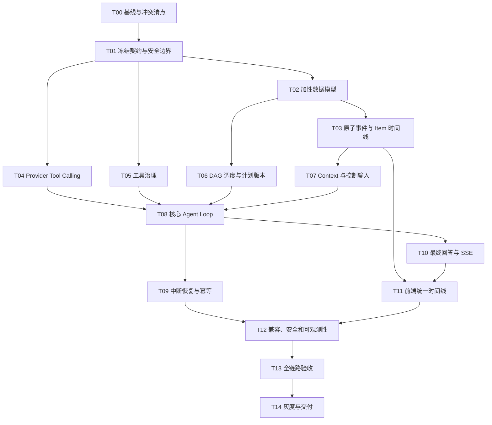

# CyberGuard 代码漏洞审查 Agent 改造执行任务书

> 文档版本：1.2.0
> 冻结日期：2026-08-16
> 适用仓库：`D:\workproject\work\work-5238`
> 上位规格：`agent-redesign/spec.md`
> 验收依据：`agent-redesign/checklist.md`
> 执行对象：后续负责落地改造的编码 Agent；允许按批次更换 Agent，但不得跳过交接证据。
> 修订记录：v1.2.0（2026-08-16）补齐 V3 运行时危险配置技能、真实 Provider 调用统计口径、三断点浏览器验收与平板导航修复；v1.1.0（2026-08-12）引入 Reasoning Summary（模型真实输出受限摘要），同步更新 T01/T11/T12 的契约、组件与清理任务。

---

## 0. 执行纪律

### 0.1 状态标记

每个执行 Agent 只能使用以下状态更新本任务书副本或交付记录：

- `[ ]`：尚未开始。
- `[-]`：正在进行，必须写明当前分支、目标文件与最后一个已验证命令。
- `[x]`：实现、验证和证据全部完成。
- `[!]`：被外部条件阻塞，必须写明阻塞证据、已完成部分和恢复入口；不得用它掩盖测试失败。

### 0.2 每个批次的固定顺序

1. 阅读 `AGENTS.md`、`CLAUDE.md`、`.claude/rules/` 和三件套文档。
2. 执行 `git status --short --branch`，再对本批次目标文件执行 `git diff -- <paths>`。
3. 确认 `backend\venv\Scripts\python.exe` 存在；禁止使用裸 `python` 执行后端命令。
4. 先写失败测试并确认失败原因正是缺少目标能力，而非环境或既有回归。
5. 实现当前最小纵向切片，不夹带无关重构。
6. 先跑 focused tests，再跑受影响的组合测试。
7. 执行 `git diff --check`，检查中文编码、秘密泄露、超长单行和意外生成物。
8. 对照 `checklist.md` 填入命令、结果、数据库/API/SSE/浏览器证据。
9. 仅在当前会话已获代码改造与提交授权时，按仓库规则提交中文 commit 并推送；只暂存本批次文件和目标 hunk。
10. 向下一 Agent 交接：完成项、未完成项、失败命令、当前提交、工作区遗留改动与下一条精确命令。

### 0.3 强制安全边界

- 不启动、停止、重启或终止前端、后端、Redis、RQ、Qdrant 等常驻进程，除非用户在当前会话明确授权。
- 不读取、打印或提交 `backend/.env`、Token、密钥、Cookie、授权头、运行日志原文、上传源码全文和构建产物。
- 不执行、构建、安装依赖或导入被审查项目；所有新工具仍只能读取 CyberGuard 授权的不可变快照。
- 不执行破坏性数据库命令；迁移只允许加性、幂等。
- 不运行 `npm --prefix frontend run lint`，因为当前脚本带自动修复；前端使用 build、永久测试脚本和浏览器验收。
- 不向数据库、持久化 SSE Event、API、日志或历史前端状态写入完整模型隐藏思维链全文；
  默认只允许经脱敏、限长并标注敏感等级的 Reasoning Summary 与 Decision Summary（spec
  v1.1 决策，用户已拍板）。V3 Provider 明确返回的原始 reasoning 仅按 §25.3 的活动连接
  瞬时例外处理。
- 当前工作区已有大量用户改动。目标文件出现既有 diff 时，必须保留并按 hunk 最小修改；无法安全隔离则暂停并报告。

### 0.4 任务依赖图



不得在 T03、T04、T05、T06、T07 未完成前把 T08 视为完整；允许并行开发，但写集成代码前必须合并并重新验证其依赖批次。

### 0.5 多 Agent 分工与合并纪律

| 执行角色 | 首选批次 | 独占写入范围 | 开始条件 |
|---|---|---|---|
| 契约负责人 | T01 | `loop/actions.py`、`loop/policy.py`、`model/contracts.py`、`timeline/contracts.py` | T00 完成 |
| 持久化负责人 | T02 → T03 | migration、Agent models、timeline service、event/state/checkpoint 事务边界 | T01 契约合并 |
| Provider 负责人 | T04 | model gateway/parser/renderer、LLM adapter 与调用记录 | T01 契约合并 |
| Tool 负责人 | T05 | tool contracts/registry/validator/deadline/executor、budget/approval policy | T01 契约合并 |
| Planning 负责人 | T06 | planning package、planner/replanner/validator/strategy | T01 契约合并 |
| Context 负责人 | T07 | context assembler、summary、control input、conversation service | T02/T03 数据与事件契约合并 |
| 集成负责人 | T08 → T10 | engine/completion、runner/service/watchdog/SSE 集成 | T03-T07 全部合并并通过 focused tests |
| 前端负责人 | T11 | timeline reducer/parser/store/composable/components/AgentChat | T03 与 T10 API/Event 契约冻结 |
| 安全兼容负责人 | T12 | v1 adapter、鉴权、敏感边界、feature flags、observability | T08-T11 合并 |
| 独立验收负责人 | T13 → T14 | 端到端、性能、浏览器、灰度、回滚和交付记录 | T12 完成 |

强制规则：

- 同一时刻一个文件只能有一个写入负责人；只读 Reviewer 可以并行，但不得顺手改文件。
- `runner.py`、`service.py`、`llm_analysis.py`、`openai_compatible.py`、`AgentChat.vue`、`eventReducer.js` 等共享/既有脏文件，只能由表中指定阶段的负责人修改。
- 各负责人从同一已验证 integration commit 开始；不得从不同脏工作区各自复制整文件后覆盖合并。
- 若使用 Git worktree，只能从用户确认的干净/已提交基线创建；包含用户未提交 hunk 的文件不得在隔离 worktree 中重写后整文件回填。
- 每个负责人交付 scoped commit 或明确 patch 范围，由集成负责人先审 diff、再合并、再重跑依赖批次测试；禁止多个 Agent 同时修改数据库迁移号。
- 独立验收负责人不得实现核心功能来“顺手修绿”；发现失败应退回对应批次负责人，并保留失败证据。

---

## T00 基线、冲突与可复现证据

**目标：** 在不修改业务代码的前提下建立可信基线，锁定既有脏工作区和当前行为。

**主要文件：**

- `AGENTS.md`
- `CLAUDE.md`
- `.claude/rules/git-commit-conventions.md`
- `.claude/rules/modular-architecture-and-reuse.md`
- `backend/app/services/security_agent/`
- `backend/app/models/agent_*.py`
- `backend/app/routes/security/`
- `frontend/src/views/security/AgentChat.vue`
- `frontend/src/features/security/agent/eventReducer.js`
- `frontend/src/composables/security/useAgentEventStream.js`

**步骤：**

- [ ] 执行并保存 `git status --short --branch`；按“用户既有改动 / 本改造预计触及 / 不相关”三类列出路径。
- [ ] 记录 `git rev-parse HEAD`、`git log -1 --format="%H %cI %s"`，作为后续测试证据基线。
- [ ] 确认 `Test-Path backend\venv\Scripts\python.exe` 返回 `True`。
- [ ] 阅读当前 Runner、Planner、Replanner、Conversation、LLM contracts、Tool Executor、Event Service、SSE 和前端 Reducer 的完整调用链。
- [ ] 特别记录 `llm_analysis.py`、`tools/executor.py`、`test_agent_llm_analysis.py`、`AgentChat.vue`、Agent Chat 新组件是否已有未提交改动；不得覆盖。
- [ ] 执行当前 Agent focused tests：

```powershell
Set-Location D:\workproject\work\work-5238\backend
.\venv\Scripts\python.exe -m pytest `
  tests\test_agent_run_api.py `
  tests\test_agent_plan_dag.py `
  tests\test_agent_plan_validator.py `
  tests\test_agent_planner.py `
  tests\test_agent_tool_registry.py `
  tests\test_agent_event_service.py `
  tests\test_agent_sse_api.py `
  tests\test_agent_conversations.py `
  tests\test_agent_message_replan_api.py `
  tests\test_agent_ops_phase.py -q
```

- [ ] 从仓库根执行 `npm --prefix frontend run build`。
- [ ] 对任何基线失败只做归因，不在本批次顺手修复；若失败影响后续，先新增一条明确的前置修复任务并获得用户确认。

**完成证据：** HEAD、工作区分类、focused tests 结果、前端 build 结果、当前 Agent 数据流图，以及已确认的既有失败清单。

**建议提交：** 本批次不改业务代码，通常不提交。

---

## T01 契约、状态语义与 Reasoning 边界

**目标：** 先用类型和测试冻结 v2 Agent 的行为边界，防止不同 Agent 各自发明协议。

**新增文件：**

- `backend/app/services/security_agent/loop/__init__.py`
- `backend/app/services/security_agent/loop/actions.py`
- `backend/app/services/security_agent/loop/policy.py`
- `backend/app/services/security_agent/model/__init__.py`
- `backend/app/services/security_agent/model/contracts.py`
- `backend/app/services/security_agent/timeline/__init__.py`
- `backend/app/services/security_agent/timeline/contracts.py`
- `backend/tests/test_agent_model_contracts.py`
- `backend/tests/test_agent_event_protocol_v2.py`
- `backend/tests/test_agent_reasoning_boundary_v2.py`

**可能修改：**

- `backend/app/services/security_agent/contracts.py`
- `backend/app/services/llm/contracts.py`
- `backend/app/services/llm/internal_reasoning_boundary.py`
- `backend/app/services/llm/redactor.py`

**测试先行：**

- [ ] 为 `AgentAction` 判别联合写序列化/反序列化失败测试，覆盖 `tool_calls`、`plan_update`、`request_approval`、`ask_user`、`final_answer`。
- [ ] 为 `AgentModelRequest` 写消息顺序、工具 schema、模式、预算、iteration 和上下文水位测试。
- [ ] 为 `AgentModelResponse` 写互斥动作测试：一轮不得同时提交最终回答和工具调用。
- [ ] 为 `AgentStreamEvent` 写 `text_delta`、`decision_summary_delta`、`tool_call_delta`、`usage`、`completed`、`error` 测试。
- [ ] 为 Event Envelope v2 写必填字段、版本和 JSON 安全序列化测试。
- [ ] 写负向测试：包含 raw reasoning/隐藏思维链全文字段时，持久化 Serializer 必须丢弃并记录安全告警码。
- [ ] 为 Reasoning Summary 写：真实 `reasoning_delta` 抽取、脱敏强制、限长截断、`sensitive_level` 标注、刷新回放一致性和完整原始全文拒绝落库测试。

**实现：**

- [ ] 使用 dataclass/Enum/项目既有类型模式定义契约；禁止扩散无边界 `dict[str, Any]`。
- [ ] Action、Item、Event、Run status 使用单一来源枚举或常量，旧常量只做兼容映射。
- [ ] `AgentLoopPolicy` 固化 `baseline/hybrid/deep_audit`、最大轮数、工具预算、重复调用上限、deadline、lease 和 heartbeat。
- [ ] 定义 `DecisionSummary` 的允许字段，只包含目标、依据引用、选定动作、策略码和下一步；不得包含隐藏推理文本。
- [ ] 定义 `ReasoningSummary` Item 契约（source_channel、redacted_text、max_chars、sensitive_level）；`AgentStreamEvent` 冻结 `reasoning_summary_delta`；任何持久化字段中出现完整原始思维链全文必须拒绝并记录安全告警码，V3 瞬时 raw relay 不得绕过该持久化门禁。
- [ ] 保持现有文本型 `LLMRequest/LLMResponse` 向后兼容；新增 Agent 契约不得破坏 QA、RAG 和修复建议调用方。
- [ ] 所有 Python 新文件包含 `# -*- coding: utf-8 -*-`，中文注释只解释关键边界。

**验证：**

```powershell
Set-Location D:\workproject\work\work-5238\backend
.\venv\Scripts\python.exe -m pytest `
  tests\test_agent_model_contracts.py `
  tests\test_agent_event_protocol_v2.py `
  tests\test_agent_reasoning_boundary_v2.py `
  tests\test_llm_provider_contract.py `
  tests\test_agent_reasoning_redaction.py -q
```

**完成条件：** v2 契约无需连接 Provider 或数据库即可被完整测试；旧 LLM 调用契约测试仍通过；
不存在完整原始思维链可持久化字段，Reasoning Summary 是唯一持久化的受控推理摘要协议；
V3 的 Provider 原始 reasoning 只能作为 §25.3 定义的非持久化瞬时通道存在。

**建议中文 commit：** `设计 Agent Loop v2 核心契约与推理边界`

---

## T02 加性数据模型、迁移与兼容模型

**目标：** 为统一 Item、控制输入、会话摘要和恢复水位提供可持久化基础，不破坏历史数据。

**新增文件：**

- `database/migrations/035_agent_loop_items.sql`，若实施时已有 `035`，顺延到实际下一个编号。
- `backend/app/models/agent_items.py`
- `backend/app/models/agent_control.py`
- `backend/tests/test_agent_loop_models.py`
- `backend/tests/test_agent_loop_migration_registry.py`

**修改文件：**

- `database/init.sql`
- `backend/app/scripts/apply_sql_migration.py`
- `backend/app/models/__init__.py`
- `backend/app/models/agent_events.py`
- `backend/app/models/agent_runtime.py`，只允许最小字段扩展；新增职责放入新模型文件。

**测试先行：**

- [ ] 写迁移注册测试：编号唯一、文件存在、顺序稳定、`database/init.sql` 包含同构表和索引。
- [ ] 写模型约束测试：`public_id` 唯一、Run 内 `client_request_id` 幂等唯一、会话摘要版本唯一。
- [ ] 写 workspace/项目/会话/turn/run 外键关系测试和跨 workspace 负向测试。
- [ ] 写 Item 生命周期、时间字段和 JSON 序列化测试。
- [ ] 写 Event `(run_id, sequence)` 唯一约束测试。
- [ ] 写兼容测试：旧 Run/Message/Event 数据仍可读取并转为 legacy item。

**实现：**

- [ ] 创建 `agent_items`、`agent_control_inputs`、`agent_conversation_summaries`。
- [ ] 扩展 `agent_events`、`agent_runs`、`agent_tool_calls`、`agent_checkpoints`，字段与 `spec.md` 第 14 节一致。
- [ ] 为 Run 内序列、item public ID、control idempotency、会话摘要水位和常用分页查询建立索引/唯一约束。
- [ ] JSON 字段使用项目现有 MySQL/SQLite 兼容写法；DDL 保持幂等。
- [ ] 不删除、不重命名、不回填覆盖旧表字段；历史数据通过 Serializer 兼容。
- [ ] 更新 `database/init.sql` 时只增加本次结构，不格式化或重排无关大段。

**验证：**

```powershell
Set-Location D:\workproject\work\work-5238\backend
.\venv\Scripts\python.exe -m pytest `
  tests\test_agent_loop_models.py `
  tests\test_agent_loop_migration_registry.py `
  tests\test_agent_event_service.py `
  tests\test_agent_conversations.py -q
```

迁移只能在用户明确确认本机数据库后，使用：

```powershell
Set-Location D:\workproject\work\work-5238\backend
.\venv\Scripts\flask.exe --app run apply-security-migrations
```

**完成条件：** 新旧模型共存；SQLite 测试和 MySQL DDL 语义一致；迁移可重复执行；无破坏性 SQL。

**建议中文 commit：** `新增 Agent Loop Item 与控制输入数据模型`

---

## T03 原子 Event Writer、统一 Item 与一致 Snapshot

**目标：** 建立后端唯一事实源，使数据库、Snapshot、SSE 和前端都消费同一条有序时间线。

**新增文件：**

- `backend/app/services/security_agent/timeline/item_service.py`
- `backend/app/services/security_agent/timeline/event_writer.py`
- `backend/app/services/security_agent/timeline/snapshot_service.py`
- `backend/app/services/security_agent/timeline/serializers.py`
- `backend/tests/test_agent_item_service.py`
- `backend/tests/test_agent_event_sequence_concurrency.py`
- `backend/tests/test_agent_snapshot_watermark.py`

**修改文件：**

- `backend/app/services/security_agent/event_service.py`
- `backend/app/services/security_agent/state_machine.py`
- `backend/app/services/security_agent/checkpoint_service.py`
- `backend/app/services/security_agent/service.py`
- `backend/app/routes/security/agent/runs.py`
- `backend/app/routes/security/agent/events.py`
- `backend/tests/test_agent_event_service.py`
- `backend/tests/test_agent_sse_api.py`

**测试先行：**

- [ ] 写并发测试：多个线程/事务同时为同一 Run 写事件，`sequence` 必须唯一且连续。
- [ ] 写回滚测试：Item 更新失败时不得留下孤立 Event；Event 插入失败时状态和水位不得前移。
- [ ] 写 Item 生命周期测试：`started → delta* → completed|failed`，终态后拒绝继续 delta。
- [ ] 写父子顺序测试：Tool Result/Observation 不得先于 Tool Call，最终 Assistant Message 不得先于最后完成判定。
- [ ] 写 Snapshot 一致性测试：所有返回内容 `sequence <= snapshot_watermark`。
- [ ] 写历史兼容测试：v1 Message/Event 被转换为 `schema_version=1` Legacy Item，不伪造 v2 顺序。
- [ ] 写 SSE replay 测试：`Last-Event-ID` 精确续传；水位过旧返回 `AGENT_SSE_REPLAY_GAP`。

**实现：**

- [ ] `EventWriter` 成为新 v2 Event 的唯一写入口；业务服务不得直接 `db.session.add(AgentEvent(...))`。
- [ ] 用 Run 行锁或数据库等价原子策略递增 `last_event_sequence`；禁止 `MAX(sequence)+1`。
- [ ] Item 状态变更、Run state version、Event、必要 Checkpoint 水位在同一事务中提交。
- [ ] `ItemService` 提供幂等 `start/append_delta/complete/fail`，每个操作接受 `dedupe_key`。
- [ ] `SnapshotService` 在固定水位读取 Run、Plan、Items、Approvals、Costs 与 Summary。
- [ ] `GET /api/security/agent-runs/{run_id}` 返回 `items` 和 `snapshot_watermark`，旧字段暂保留。
- [ ] 新增服务端分页的 `GET /api/security/agent-runs/{run_id}/items`；Route 只鉴权、校验分页参数和调用 Service。
- [ ] 保持旧事件读取 API，v2 SSE 直接流出持久化 Event Envelope，不在流层重新拼接内容。

**验证：**

```powershell
Set-Location D:\workproject\work\work-5238\backend
.\venv\Scripts\python.exe -m pytest `
  tests\test_agent_item_service.py `
  tests\test_agent_event_sequence_concurrency.py `
  tests\test_agent_snapshot_watermark.py `
  tests\test_agent_event_service.py `
  tests\test_agent_sse_api.py `
  tests\test_agent_run_api.py -q
```

**完成条件：** 对同一 Run，不存在重复序列、孤立 Item 或 Snapshot/SSE 水位竞态；v1 客户端仍可读取旧字段。

**建议中文 commit：** `建立 Agent Item 时间线与原子事件写入`

---

## T04 Provider 中立 Tool Calling 与流式模型网关

**目标：** 让模型能基于消息上下文和工具定义产生标准 Tool Call，并把 Tool Result 作为下一轮输入；同时保留旧文本型 LLM 调用。

**新增文件：**

- `backend/app/services/security_agent/model/gateway.py`
- `backend/app/services/security_agent/model/action_parser.py`
- `backend/app/services/security_agent/model/context_renderer.py`
- `backend/tests/test_agent_model_gateway.py`
- `backend/tests/test_agent_tool_call_native.py`
- `backend/tests/test_agent_tool_call_fallback.py`
- `backend/tests/test_agent_model_stream.py`

**修改文件：**

- `backend/app/services/llm/openai_compatible.py`
- `backend/app/services/llm/contracts.py`
- `backend/app/services/llm/call_logging.py`
- `backend/app/services/security_agent/providers/router.py`
- `backend/app/services/security_agent/providers/policy.py`
- `backend/app/services/security_agent/llm_invocation.py`

**测试先行：**

- [ ] 构造 Fake Provider，验证 `messages + tools + tool_choice` 被完整传入。
- [ ] 验证 Provider 原生 `tool_calls` 被标准化为一个或多个 `ToolCallAction`，保留 provider call ID。
- [ ] 验证多个并列 Tool Call 的参数 delta 能按 call ID 合并，不能串线。
- [ ] 验证 Tool Result 使用正确 `tool_call_id` 回填到下一次模型请求。
- [ ] 验证不支持原生 Tool Calling 的 Provider 走严格 JSON Fallback；格式错误只允许一次受控修复，不得 `eval` 或宽松猜测。
- [ ] 验证 Provider 返回文本与 Tool Call 混合时按协议处理，不能把未校验文本当最终回答。
- [ ] 验证流事件顺序、usage、finish reason、超时、429/5xx 和 failover。
- [ ] 验证原始 Provider 响应、Authorization、Prompt、源码片段和完整原始 reasoning 全文均不进入日志（受限 Reasoning Summary 摘要除外）。

**实现：**

- [ ] `AgentModelGateway.next_turn()` 接收 `AgentModelRequest`，返回标准化 `AgentModelResponse` 或流事件。
- [ ] Adapter 能力协商至少包含 `native_tool_calling`、`parallel_tool_calls`、`streaming_tool_deltas`、`reasoning_channel`、`max_context_tokens`。
- [ ] OpenAI-compatible 请求按 Provider 能力发送 `tools`、`tool_choice` 与历史 messages；旧 `complete/stream` API 保持兼容。
- [ ] JSON Fallback 使用固定 schema、显式版本和 allowlist Action；拒绝额外字段和未知工具。
- [ ] Context renderer 只发送脱敏后的 Tool Result Envelope 和 Artifact 引用，不发送数据库对象或完整异常。
- [ ] Call logging 仅保存 provider/model、状态、latency、usage、cost、错误码和安全 digest；删除/关闭任何 raw body 截断日志。
- [ ] Provider failover 只能在 Policy 允许、没有产生不可重放副作用且预算允许时发生，并发出 `strategy.provider_switched`。

**验证：**

```powershell
Set-Location D:\workproject\work\work-5238\backend
.\venv\Scripts\python.exe -m pytest `
  tests\test_agent_model_gateway.py `
  tests\test_agent_tool_call_native.py `
  tests\test_agent_tool_call_fallback.py `
  tests\test_agent_model_stream.py `
  tests\test_llm_provider_contract.py `
  tests\test_llm_call_logging.py `
  tests\test_llm_retry.py -q
```

**完成条件：** Fake Provider 能完成“模型 Tool Call → Tool Result 回填 → 下一轮模型动作”；旧 QA/RAG 文本调用不回归；日志无原文泄露。

**建议中文 commit：** `实现 Provider 中立的 Agent Tool Calling 网关`

---

## T05 工具目录、输入校验、授权、预算、超时与重试治理

**目标：** 把工具安全约束从描述信息升级为 Executor 强制执行的不变量。

**新增文件：**

- `backend/app/services/security_agent/tools/validator.py`
- `backend/app/services/security_agent/tools/deadline.py`
- `backend/tests/test_agent_tool_input_validation.py`
- `backend/tests/test_agent_tool_policy_enforcement.py`
- `backend/tests/test_agent_tool_timeout_retry.py`
- `backend/tests/test_agent_tool_idempotency.py`

**修改文件：**

- `backend/app/services/security_agent/tools/contracts.py`
- `backend/app/services/security_agent/tools/registry.py`
- `backend/app/services/security_agent/tools/executor.py`
- `backend/app/services/security_agent/approval_policy.py`
- `backend/app/services/security_agent/approval_service.py`
- `backend/app/services/security_agent/budget.py`
- 各 `backend/app/services/security_agent/tools/*_tools.py` 的 Descriptor 定义

**测试先行：**

- [ ] 未知工具、未知字段、缺少 required、类型错误、越界整数、超长字符串和恶意路径必须在 Handler 前拒绝。
- [ ] Workspace、project、snapshot 与对象级权限不匹配时拒绝，且 Handler 调用次数为零。
- [ ] `prohibited` 工具永不执行；`sensitive_read` 和需要审批的调用在未批准时进入中断态。
- [ ] 超预算、超轮数、超 deadline、Run 已 pause/cancel 时不得启动新工具。
- [ ] 相同 `logical_call_key + arguments_digest` 的已完成幂等调用应复用结果，不得重复执行。
- [ ] 只有 `idempotent=True && retryable=True && 错误码允许` 才自动重试；attempt 递增并保留逻辑调用关联。
- [ ] 硬超时后迟到结果不能把 canceled/failed 调用改成 succeeded。
- [ ] Tool Result 必须经过结果 schema 校验、截断、脱敏并只返回 Artifact/Observation 引用。

**实现：**

- [ ] 扩展 Descriptor：`retry_policy`、`allowed_modes`、`result_schema_version`、输入/输出限制。
- [ ] 复用 `marshmallow==3.20.1` 做边界对象校验；对 Descriptor 的 JSON Schema 子集实现本地、确定性的 validator，至少支持 `type/properties/required/additionalProperties/items/minimum/maximum/minLength/maxLength/enum`，不新增依赖。
- [ ] 固定执行顺序：存在性 → 模式/Workspace Policy → schema → 对象权限 → 风险/审批 → 预算预留 → 幂等检查 → deadline/cancel → Handler → 结果校验/脱敏 → 持久化 → 预算结算 → Event/Checkpoint。
- [ ] `ToolExecutionContext` 必须携带不可变 workspace/project/snapshot、actor、deadline、trace、logical call key；Handler 不从 HTTP 全局猜身份。
- [ ] 将现有 Executor 拆分为编排层和边界模块，避免继续扩展巨型文件。
- [ ] 长工具只能发数字进度和安全摘要；不发源码、Prompt、异常原文。
- [ ] 为每个注册工具补全模式、风险、审批、超时、幂等和结果版本；缺字段导致注册失败，而不是使用危险默认值。

**验证：**

```powershell
Set-Location D:\workproject\work\work-5238\backend
.\venv\Scripts\python.exe -m pytest `
  tests\test_agent_tool_input_validation.py `
  tests\test_agent_tool_policy_enforcement.py `
  tests\test_agent_tool_timeout_retry.py `
  tests\test_agent_tool_idempotency.py `
  tests\test_agent_tool_registry.py `
  tests\test_agent_repository_tools.py `
  tests\test_agent_scan_tools.py `
  tests\test_agent_budget.py `
  tests\test_agent_approval_review.py -q
```

**完成条件：** 所有工具在统一 Executor 门禁下运行；任何越权/非法/超时/重复调用都不能到达 Handler 或污染成功状态。

**建议中文 commit：** `强化 Agent 工具执行安全与幂等治理`

---

## T06 真正的 DAG Scheduler 与版本化计划服务

**目标：** 把计划从按 ID 排序的清单升级为运行时真正执行依赖的 DAG；失败前置不能被当作完成。

**新增文件：**

- `backend/app/services/security_agent/planning/__init__.py`
- `backend/app/services/security_agent/planning/scheduler.py`
- `backend/app/services/security_agent/planning/plan_service.py`
- `backend/app/services/security_agent/planning/completion_criteria.py`
- `backend/tests/test_agent_dag_scheduler.py`
- `backend/tests/test_agent_plan_patch.py`
- `backend/tests/test_agent_mandatory_baseline.py`

**修改文件：**

- `backend/app/services/security_agent/planner.py`
- `backend/app/services/security_agent/replanner.py`
- `backend/app/services/security_agent/plan_validator.py`
- `backend/app/services/security_agent/strategy_catalog.py`
- `backend/app/services/security_agent/runner.py`，此阶段只替换旧节点遍历入口，不承载新 Loop。
- `backend/tests/test_agent_plan_dag.py`
- `backend/tests/test_agent_plan_validator.py`
- `backend/tests/test_agent_planner.py`
- `backend/tests/test_agent_evidence_replan.py`

**测试先行：**

- [ ] 拓扑无关测试：节点 ID 顺序与依赖顺序相反时，仍按依赖执行。
- [ ] 多前置测试：只有全部依赖成功或被明确允许跳过，节点才进入 READY。
- [ ] 失败传播测试：强制前置失败后，后置为 BLOCKED，不进入 Executor；Run 不得错误完成。
- [ ] 环、自依赖、未知依赖、重复 node key、未知工具和模式禁止工具均被 Validator 拒绝。
- [ ] 可并行节点只在工具和数据库边界支持时并行；默认确定性串行仍须正确。
- [ ] Plan Patch 只能追加/替换合法未完成节点，不能改写已执行历史或删除强制基线。
- [ ] 计划版本上限、重复 patch 和 digest 幂等测试。

**实现：**

- [ ] 定义 `PENDING/READY/RUNNING/SUCCEEDED/FAILED/SKIPPED/BLOCKED/CANCELED` 语义和合法转换。
- [ ] Scheduler 计算 READY 集合，不再使用 `sorted(plan.nodes, key=id)` 作为执行语义。
- [ ] FAILED 节点不得加入“完成依赖”集合；只有 `SUCCEEDED`，以及策略显式允许的 `SKIPPED`，可以满足依赖。
- [ ] 强制基线由 Controller 注入并锁定；模型可提出 Plan Patch，但必须由 `PlanService` 校验和版本化。
- [ ] 每次 Plan 创建/更新持久化 digest、parent version、原因码和 Decision Record，并写 v2 Item/Event。
- [ ] Replanner 固定规则保留为 fallback/Controller feedback 来源，不再成为唯一“多轮策略”。
- [ ] `CompletionCriteria` 为每种模式定义 mandatory node keys、覆盖和证据条件。

**验证：**

```powershell
Set-Location D:\workproject\work\work-5238\backend
.\venv\Scripts\python.exe -m pytest `
  tests\test_agent_dag_scheduler.py `
  tests\test_agent_plan_patch.py `
  tests\test_agent_mandatory_baseline.py `
  tests\test_agent_plan_dag.py `
  tests\test_agent_plan_validator.py `
  tests\test_agent_planner.py `
  tests\test_agent_evidence_replan.py -q
```

**完成条件：** DAG 依赖由运行时执行；失败前置能稳定阻断；所有计划更新可追溯且不能绕过基线。

**建议中文 commit：** `实现 Agent 计划 DAG 调度与版本治理`

---

## T07 Context Assembler、结构化摘要与有序控制输入

**目标：** 让每一轮模型决策看到当前目标、最新用户输入、计划、真实 Observation、预算和审批状态；支持同一 Run 内真正的多轮交互。

**新增文件：**

- `backend/app/services/security_agent/loop/context_assembler.py`
- `backend/app/services/security_agent/loop/control_inputs.py`
- `backend/app/services/security_agent/loop/conversation_summary.py`
- `backend/tests/test_agent_context_assembler.py`
- `backend/tests/test_agent_control_inputs.py`
- `backend/tests/test_agent_conversation_summary.py`

**修改文件：**

- `backend/app/services/security_agent/context_builder.py`
- `backend/app/services/security_agent/conversation_service.py`
- `backend/app/routes/security/agent/conversations.py`
- `backend/app/routes/security/agent/runs.py`
- `backend/tests/test_agent_conversations.py`
- `backend/tests/test_agent_message_replan_api.py`

**测试先行：**

- [ ] Context 优先级测试：系统安全边界和当前 Control Input 不能被旧摘要覆盖。
- [ ] Tool Result 回填测试：第 N+1 轮模型请求必须包含第 N 轮真实结果 envelope 和引用。
- [ ] 上下文裁剪测试：超限时先摘要低价值历史，保留当前目标、未完成条件、最近 Observation、审批和预算。
- [ ] 摘要水位/digest/version 测试；摘要只能覆盖其声明的 sequence 区间。
- [ ] 摘要失败测试：发出 `AGENT_CONTEXT_LIMITED` 并缩短 recent window，不静默丢关键约束。
- [ ] 活跃 Run 用户消息测试：HTTP 线程只幂等写 Message + Control Input + Event + 唤醒，不同步创建 Plan 或执行工具。
- [ ] 同一 `client_request_id` 重试只产生一个 Control Input；并发输入按 Run 序列应用。
- [ ] Pause/Resume/Cancel/Approval 与用户消息在同一控制输入队列中有确定优先级。

**实现：**

- [ ] `ContextAssembler.build()` 生成 `spec.md` 第 8 节定义的 `AgentContextPack`。
- [ ] 只传安全摘要、结构化 Finding/Observation、Artifact 引用和受限代码切片，不传完整历史事件或上传源码全文。
- [ ] `ConversationSummaryService` 生成结构化摘要，持久化 source watermark、version 和 SHA-256 digest。
- [ ] `ControlInputService` 提供 `enqueue/list_pending/apply/reject/supersede`，所有操作幂等并发 Event。
- [ ] 新增统一 `POST /api/security/agent-runs/{run_id}/control-inputs`；现有 Conversation Message API 内部转调该 Service。
- [ ] 活跃 Run 收到消息时只唤醒/重新入队；Loop 在安全边界读取并决定 Plan Patch、继续、请求审批或询问用户。
- [ ] 多个用户消息到达时按 sequence 应用；取消优先于新工具调度，审批只作用于对应 request/call。
- [ ] Conversation `context_version/summary_version` 与持久化摘要一致更新。

**验证：**

```powershell
Set-Location D:\workproject\work\work-5238\backend
.\venv\Scripts\python.exe -m pytest `
  tests\test_agent_context_assembler.py `
  tests\test_agent_control_inputs.py `
  tests\test_agent_conversation_summary.py `
  tests\test_agent_conversations.py `
  tests\test_agent_message_replan_api.py -q
```

**完成条件：** 同一 Run 能在工具执行之间吸收用户新方向；每轮上下文可解释、可复现、受水位约束且不泄露原文。

**建议中文 commit：** `实现 Agent 多轮上下文与有序控制输入`

---

## T08 核心 AgentLoopEngine 纵向切片

**目标：** 用一个可测试的模型在环闭环替代“一次 LLM 计划 + 固定工具队列 + 末尾总结”，并保留 `baseline` 降级路径。

**新增文件：**

- `backend/app/services/security_agent/loop/engine.py`
- `backend/app/services/security_agent/loop/completion_evaluator.py`
- `backend/tests/test_agent_loop_engine.py`
- `backend/tests/test_agent_loop_completion.py`
- `backend/tests/test_agent_loop_limits.py`
- `backend/tests/test_agent_loop_vertical_slice.py`

**修改文件：**

- `backend/app/services/security_agent/runner.py`
- `backend/app/services/security_agent/service.py`
- `backend/app/services/security_agent/evidence_evaluator.py`
- `backend/app/services/security_agent/decision_records.py`
- `backend/app/services/security_agent/llm_analysis.py`
- `backend/tests/test_agent_ops_phase.py`
- `backend/tests/test_agent_run_api.py`
- `backend/tests/test_agent_deep_review.py`

**测试先行：**

- [ ] 用 Scripted/Fake Model 构造至少三轮：Model Decision → Tool A → Tool Result → Model Plan Patch/Decision → Tool B → Observation → Final Answer。
- [ ] 断言第二次模型调用真实包含 Tool A 的结果，而非只包含初始目标。
- [ ] 断言每轮先应用控制输入、检查 pause/cancel/deadline/budget、刷新 lease，再调用模型或工具。
- [ ] 断言 `baseline` 模式不伪装自治：Controller 固定执行强制 DAG，模型仅生成安全最终摘要。
- [ ] 断言 `hybrid` 在基线后允许受控自主工具；`deep_audit` 受更高但有限预算约束。
- [ ] 断言重复相同工具参数、连续模型错误、超轮数、超计划版本、超预算和超墙钟时间都停止循环并产生正确告警/终态。
- [ ] 断言模型提交过早 Final Answer 时，Completion Evaluator 返回缺失条件并将 Controller Feedback 放入下一轮上下文。
- [ ] 断言模型不可直接执行工具、改 Run 状态、写 DB 或绕过 Scheduler。

**实现：**

- [ ] `AgentLoopEngine.run_until_interrupt(run_id, trace_id)` 只编排 Controller 服务，不直接承担 Provider、SQL、工具或序列化细节。
- [ ] 每轮严格执行：续租 → 应用 Control Input → 检查硬限制 → 组装上下文 → 模型决策 → 标准化 Action → 策略校验 → 执行动作 → 持久化 Item/Event → Checkpoint → 下一轮。
- [ ] Tool Call 一轮可有多个，但第一阶段默认按稳定顺序串行执行；只有显式无依赖且工具允许并行时才并行。
- [ ] `plan_update/request_approval/ask_user/final_answer` 都是显式 Action，不能依赖自由文本猜测。
- [ ] 强制基线由 Controller/Scheduler 驱动；模型无法删除、跳过或标记其成功。
- [ ] `CompletionEvaluator` 使用模式、mandatory nodes、证据、覆盖、失败、警告、预算和用户目标判定 `completed/completed_with_warnings/partial/failed/canceled`。
- [ ] 旧 `runner.py` 退化为兼容入口和 v1/v2 feature flag 路由，不再继续堆职责。
- [ ] 移除“无论节点失败都加入 completed_keys”“FAILED 仍可最终 completed”等旧语义。
- [ ] `llm_analysis.py` 只持久化脱敏、限长并标注 `sensitive_level` 的 Reasoning Summary，不再持久化完整原始思维链；v2 最终分析由 Loop 中的 Assistant Message Item 承载。旧路径只保留安全兼容摘要。

**验证：**

```powershell
Set-Location D:\workproject\work\work-5238\backend
.\venv\Scripts\python.exe -m pytest `
  tests\test_agent_loop_engine.py `
  tests\test_agent_loop_completion.py `
  tests\test_agent_loop_limits.py `
  tests\test_agent_loop_vertical_slice.py `
  tests\test_agent_ops_phase.py `
  tests\test_agent_run_api.py `
  tests\test_agent_deep_review.py `
  tests\test_agent_evidence_replan.py -q
```

**完成条件：** 自动化测试能证明模型依据真实 Observation 多轮调整动作；五种终态符合证据，不再由“Runner 跑完”粗略决定。

**建议中文 commit：** `落地模型在环的安全审查 Agent Loop`

---

## T09 Lease、Checkpoint、审批、暂停、取消与崩溃恢复

**目标：** 任何中断都能从确定检查点继续，且不会重复已完成工具或丢失控制输入。

**新增文件：**

- `backend/app/services/security_agent/loop/lease_service.py`
- `backend/tests/test_agent_loop_checkpoint_recovery.py`
- `backend/tests/test_agent_loop_lease.py`
- `backend/tests/test_agent_loop_interrupts.py`
- `backend/tests/test_agent_loop_exactly_once.py`

**修改文件：**

- `backend/app/services/security_agent/checkpoint_service.py`
- `backend/app/services/security_agent/watchdog.py`
- `backend/app/services/security_agent/approval_service.py`
- `backend/app/services/security_agent/service.py`
- `backend/app/services/security_agent/runner.py`
- `backend/app/routes/security/agent/approvals.py`
- `backend/app/routes/security/agent/runs.py`
- `backend/tests/test_agent_approval_review.py`
- `backend/tests/test_agent_approvals_api.py`
- `backend/tests/test_agent_rq_dispatch.py`
- `backend/tests/test_agent_state_machine.py`

**测试先行：**

- [ ] 两个 Worker 竞争同一 Run 时只有一个获得有效 lease；过期 lease 可被恢复，未过期不可抢占。
- [ ] 在 Model 完成后、Tool 开始前；Tool 完成后、Event 前；Event 后、Checkpoint 前分别模拟崩溃，恢复结果保持一致。
- [ ] 已完成幂等 Tool 在恢复后复用原结果；非幂等未知状态不得自动重试，Run 进入人工判断/partial。
- [ ] Approval request 中断后不再占用 Worker；批准/拒绝只写 Control Input 并唤醒。
- [ ] Pause 在安全边界生效，Resume 从 Checkpoint 继续；Cancel 后不启动新工具，迟到结果不推进成功。
- [ ] Watchdog 只恢复满足安全条件的 Run，超过恢复上限显式失败并保留证据。
- [ ] 重复 dispatch/RQ 消息不造成重复 Tool Call、Event 或 Assistant delta。

**实现：**

- [ ] `LeaseService` 原子 acquire/refresh/release，绑定 owner 和到期时间；每轮及长工具期间刷新 heartbeat。
- [ ] Checkpoint 至少记录 iteration、context watermark、current item、plan version、pending control watermark、budgets、lease owner 和 digest。
- [ ] Checkpoint 在可重放边界生成，不保存 Python 对象、Provider 客户端或不可序列化状态。
- [ ] Approval/Pause/Ask User 返回“中断”，不使用睡眠轮询占住 Worker。
- [ ] Resume/Retry 只创建控制输入并调度原 Run；不得在 HTTP 请求线程同步推进 Loop。
- [ ] Watchdog 使用 lease/checkpoint/recovery policy，而非只凭状态字符串盲目重跑整个 Runner。
- [ ] 幂等键覆盖 Control Input、Tool logical call、Item transition、Event dedupe 和 dispatch job。

**验证：**

```powershell
Set-Location D:\workproject\work\work-5238\backend
.\venv\Scripts\python.exe -m pytest `
  tests\test_agent_loop_checkpoint_recovery.py `
  tests\test_agent_loop_lease.py `
  tests\test_agent_loop_interrupts.py `
  tests\test_agent_loop_exactly_once.py `
  tests\test_agent_approval_review.py `
  tests\test_agent_approvals_api.py `
  tests\test_agent_rq_dispatch.py `
  tests\test_agent_state_machine.py -q
```

**完成条件：** 崩溃、重复投递、审批、暂停和取消均有确定恢复语义；已完成工具不重复执行。

**建议中文 commit：** `完善 Agent Loop 中断恢复与租约幂等`

---

## T10 最终回答增量、SSE 重放与连接健康

**目标：** 将 Assistant 最终回答和所有时间线 Item 通过同一持久 Event 流按序送达，刷新或重连后结果完全一致。

**新增文件：**

- `backend/tests/test_agent_assistant_stream.py`
- `backend/tests/test_agent_sse_reconnect_v2.py`
- `backend/tests/test_agent_sse_heartbeat_v2.py`

**修改文件：**

- `backend/app/services/security_agent/sse.py`
- `backend/app/services/security_agent/timeline/item_service.py`
- `backend/app/services/security_agent/timeline/snapshot_service.py`
- `backend/app/routes/security/agent/events.py`
- `backend/app/routes/security/agent/runs.py`
- `backend/tests/test_agent_sse_api.py`

**测试先行：**

- [ ] Final Answer 创建 `started`，多个 `delta` 更新同一 item，最终 `completed` 冻结内容。
- [ ] 每个 delta 先持久化再流出；断线后从 `Last-Event-ID` 重放不会漏字、重复字或改变顺序。
- [ ] Snapshot 在任意水位都只返回已提交内容；完成后刷新得到与流累计完全相同的文本。
- [ ] Heartbeat 能被客户端 parser 识别，且不进入用户时间线。
- [ ] 历史缺口返回明确错误并触发 Snapshot 重同步。
- [ ] 慢客户端、取消连接和生成中 Provider 错误不会破坏 Item 终态。
- [ ] SSE payload 不含完整原始 reasoning 全文、堆栈、原始 Provider body、Token 或完整源码。

**实现：**

- [ ] Assistant Message delta 使用 Item/Event 服务，不直接从 Provider socket 透传未持久化内容。
- [ ] SSE Event `id` 等于持久化 sequence；`event` 等于冻结的 v2 event type；`data` 为 envelope JSON。
- [ ] Heartbeat 采用正式 `heartbeat` 事件或 parser 支持的 keepalive 回调，并刷新连接健康时间。
- [ ] 服务端处理 `Last-Event-ID`、`after_sequence` 和 replay gap；不在 SSE route 驱动 Agent。
- [ ] terminal event 之后关闭流；客户端仍可用 Snapshot 获取完整内容。
- [ ] 对 delta 频率/大小设置上限，必要时安全合并，但不改变语义顺序。

**验证：**

```powershell
Set-Location D:\workproject\work\work-5238\backend
.\venv\Scripts\python.exe -m pytest `
  tests\test_agent_assistant_stream.py `
  tests\test_agent_sse_reconnect_v2.py `
  tests\test_agent_sse_heartbeat_v2.py `
  tests\test_agent_sse_api.py `
  tests\test_agent_snapshot_watermark.py -q
```

**完成条件：** SSE 是持久事件的传输层而非第二事实源；重连、刷新、慢客户端和错误下均可恢复一致内容。

**建议中文 commit：** `实现 Agent 最终回答持久流与 SSE 重放`

---

## T11 前端事件源统一时间线

**目标：** 前端只根据后端 v2 Item/Event 的真实 `sequence` 渲染交错时间线，不再把 reasoning、steps、toolCalls、messages 分组后人为拼接。

**新增文件：**

- `frontend/src/features/security/agent/timelineReducer.js`
- `frontend/src/features/security/agent/sseParser.js`
- `frontend/src/components/security/agent/timeline/AgentTimeline.vue`
- `frontend/src/components/security/agent/timeline/AgentTimelineItem.vue`
- `frontend/src/components/security/agent/timeline/UserMessageItem.vue`
- `frontend/src/components/security/agent/timeline/IntentSummaryItem.vue`
- `frontend/src/components/security/agent/timeline/PlanItem.vue`
- `frontend/src/components/security/agent/timeline/DecisionSummaryItem.vue`
- `frontend/src/components/security/agent/timeline/ReasoningSummaryItem.vue`
- `frontend/src/components/security/agent/timeline/ToolCallItem.vue`
- `frontend/src/components/security/agent/timeline/ToolResultItem.vue`
- `frontend/src/components/security/agent/timeline/ObservationItem.vue`
- `frontend/src/components/security/agent/timeline/ApprovalItem.vue`
- `frontend/src/components/security/agent/timeline/AssistantMessageItem.vue`
- `frontend/src/components/security/agent/timeline/ControllerFeedbackItem.vue`
- `frontend/src/components/security/agent/timeline/WarningItem.vue`
- `frontend/src/components/security/agent/timeline/TimelineSkeleton.vue`
- `frontend/tests/agent-timeline-reducer.test.mjs`
- `frontend/tests/agent-sse-parser.test.mjs`

**修改文件：**

- `frontend/package.json`
- `frontend/src/api/index.js`
- `frontend/src/stores/agentRunStore.js`
- `frontend/src/features/security/agent/eventReducer.js`
- `frontend/src/composables/security/useAgentEventStream.js`
- `frontend/src/composables/security/useAgentRun.js`
- `frontend/src/views/security/AgentChat.vue`
- `frontend/src/components/security/agent/chat/AgentChatMessage.vue`
- `frontend/src/components/security/agent/chat/AgentChatThinking.vue`
- `frontend/src/components/security/agent/chat/AgentChatToolCalls.vue`
- `frontend/src/components/security/agent/AgentReasoningStream.vue`

**测试先行：**

- [ ] 在 `frontend/package.json` 增加永久脚本 `test:agent`，使用 Node 内置 test runner；不引入测试依赖。
- [ ] Reducer 测试：乱序批次按 sequence 应用，同一 item 的 delta 不改变位置，重复 event/delta 幂等。
- [ ] Gap 测试：任何 event type 都先检查 sequence，包括 legacy reasoning；发现缺口停止增量应用并要求 Snapshot 重同步。
- [ ] Snapshot hydration 测试：`itemsById/itemOrder/lastSequence/snapshotWatermark` 与服务端水位一致。
- [ ] Generation token 测试：切换 Run 后，旧 Snapshot 或旧 SSE 帧不能覆盖新状态。
- [ ] SSE parser 测试：解析 `id/event/data`、正式 heartbeat、多行 data、尾帧、错误帧和 replay gap。
- [ ] Assistant delta 测试：刷新前流累计文本与刷新后 Snapshot 文本完全一致，不重复追加消息。
- [ ] Legacy v1 测试：旧事件可显示脱敏安全摘要，但完整原始思维链字段必须忽略。

**实现：**

- [ ] `timelineReducer.js` 保持纯函数、无 Vue/Pinia/API alias 依赖，便于 Node 内置 test 直接导入。
- [ ] Store 收敛到 `run/itemsById/itemOrder/lastSequence/snapshotWatermark/stateVersion/connectionState/gapDetected/terminal/approvals/costs`。
- [ ] `itemOrder` 仅由 Item 首个事件的 sequence 决定；delta 只更新目标 item。
- [ ] `sseParser.js` 成为 Agent SSE 的单一 parser；`api/index.js` 不再维护第二份解析逻辑。
- [ ] `useAgentEventStream` 在收到首个有效响应、heartbeat 或 event 后置为 `connected`；所有帧刷新健康定时器。
- [ ] replay gap 时中止当前流、拉取一致 Snapshot，再从 watermark 重连；避免无限快速重连。
- [ ] `AgentChat.vue` 退化为页面编排层，不再构造一个包含所有 reasoning/toolCalls/steps 的伪 Agent message。
- [ ] Timeline 按真实顺序渲染 User、Intent、Plan、Decision Summary、Tool Call/Result、Observation、Approval、Controller Feedback、Warning、Assistant Message。
- [ ] v2 UI 显示受限 Reasoning Summary（标注“推理摘要”），不显示完整原始思维链；旧 `AgentReasoningStream` / `AgentChatThinking` 迁移为 ReasoningSummary/DecisionSummary 展示，不得恢复原始隐藏字段或伪造思考文案。
- [ ] 所有组件优先使用 `BaseIcon/BaseButton/BaseBadge/BasePanel`，含 loading/empty/error/success，使用 `<style scoped lang="scss">`。
- [ ] 桌面、平板、手机三断点；平板主/侧栏变单列，手机侧栏为抽屉，Timeline 长历史分页、折叠或窗口化。
- [ ] 工具参数和结果默认折叠，只显示脱敏摘要；源码引用通过现有授权 Evidence Viewer 打开。

**验证：**

```powershell
Set-Location D:\workproject\work\work-5238
npm --prefix frontend run test:agent
npm --prefix frontend run build
```

**完成条件：** 同一 Run 的数据库 sequence、Snapshot、SSE 和 UI 排列一致；前端不再伪造“思考在前、工具在后”的分组时间线。

**建议中文 commit：** `重构 Agent Chat 为事件源统一时间线`

---

## T12 v1 兼容、鉴权、敏感数据与可观测性收口

**目标：** 在不破坏历史 Run 和既有功能的前提下，为 v2 加上 workspace 隔离、安全日志、功能开关、指标和明确降级标签。

**新增文件：**

- `backend/app/services/security_agent/timeline/legacy_adapter.py`
- `backend/tests/test_agent_v1_compatibility.py`
- `backend/tests/test_agent_authorization_v2.py`
- `backend/tests/test_agent_sensitive_data_boundary_v2.py`
- `backend/tests/test_agent_observability_v2.py`

**修改文件：**

- `backend/app/config.py`
- `backend/.env.example`
- `backend/app/services/security_agent/service.py`
- `backend/app/services/security_agent/llm_analysis.py`
- `backend/app/services/llm/openai_compatible.py`
- `backend/app/services/llm/call_logging.py`
- `backend/app/services/llm/redactor.py`
- `backend/app/services/agent_observability.py`
- `backend/app/routes/security/agent/*.py`
- `frontend/src/features/security/agent/eventReducer.js`
- `frontend/src/views/security/AgentChat.vue`

**测试先行：**

- [ ] v1 Run、Message、Event、Approval、Observation、Cost 和 Plan 的读取 API 仍兼容。
- [ ] v2 新 Run 只写 v2 Item/Event；旧字段若需返回，由 Serializer 派生，不双写两个相互竞争的事实源。
- [ ] 旧 Run 不因打开 v2 flag 被错误送入新 Loop；新 Run 可按 workspace/全局 flag 选择 v1/v2。
- [ ] 不同 workspace、不同 project、无权限角色、未登录用户读取 Run/Items/SSE/Control Input/Approval 全部拒绝。
- [ ] 用户控制的 run ID、conversation ID、turn ID、item ID、snapshot ID 不得绕过关联校验。
- [ ] 敏感边界测试扫描 DB payload、API JSON、SSE frame 和测试 logger，拒绝 Token、Authorization、Cookie、raw provider body、raw prompt、完整原始 reasoning 全文、完整源码和堆栈；Reasoning Summary 必须已脱敏、限长并带 `sensitive_level`。
- [ ] 审计测试只记录 actor、workspace、run、action、policy/result code、trace、usage/cost 与 digest。
- [ ] 降级测试：Provider 不可用时按模式进入 baseline/partial，并在 API/UI 明确显示，不伪装模型在环成功。

**实现：**

- [ ] 增加 `AGENT_LOOP_V2_ENABLED`、`AGENT_EVENT_SCHEMA_V2_ENABLED`、`AGENT_TIMELINE_V2_ENABLED`，默认 `false`；支持全局和 workspace policy。
- [ ] `.env.example` 只写安全占位和说明，不读取/复制真实 `.env`。
- [ ] `legacy_adapter.py` 只做 v1 → legacy item 映射，所有 legacy item 标注 schema version 和来源。
- [ ] 将 `llm_analysis.py` 及其既有未提交改动中的 `llm_reasoning` 持久化迁移为 v2 受限 Reasoning Summary（脱敏、限长、`sensitive_level`、可回放）；完整原始思维链全文不得落库；先审阅并保留用户其他意图修改。
- [ ] 移除 OpenAI-compatible raw response/raw body 日志；日志只保留长度、digest、状态、usage、latency 和安全错误码。
- [ ] 所有 Agent Route 继续使用服务端 workspace/project/object 鉴权；列表使用服务端分页。
- [ ] 指标至少覆盖 iteration、tool calls、replans、provider switches、context compression、approval wait、completion status、recovery、event lag、SSE reconnect/gap。
- [ ] UI 显示“模型在环 / 策略工作流 / 已降级 / 等待审批 / 部分完成”，标签由后端事实字段驱动。
- [ ] 不删除旧 API、旧表或旧字段；清理工作另立后续版本，不混入本改造。

**验证：**

```powershell
Set-Location D:\workproject\work\work-5238\backend
.\venv\Scripts\python.exe -m pytest `
  tests\test_agent_v1_compatibility.py `
  tests\test_agent_authorization_v2.py `
  tests\test_agent_sensitive_data_boundary_v2.py `
  tests\test_agent_observability_v2.py `
  tests\test_agent_authorization.py `
  tests\test_agent_behavior_logging.py `
  tests\test_agent_llm_analysis.py `
  tests\test_llm_call_logging.py `
  tests\test_agent_ops_api.py -q
```

```powershell
Set-Location D:\workproject\work\work-5238
npm --prefix frontend run test:agent
npm --prefix frontend run build
```

**完成条件：** v1 历史可读、v2 安全可控、跨 workspace 负向测试通过，任何输出面均无完整原始思维链全文；Reasoning Summary 全部脱敏、限长并标注敏感等级。

**建议中文 commit：** `收口 Agent v2 兼容鉴权与敏感数据边界`

---

## T13 自动化、真实性能与真实浏览器全链路验收

**目标：** 用自动化和用户授权的真实运行证明系统不是演示：模型确实多轮看见工具结果，SSE 与数据库一致，恢复和安全边界真实有效。

**新增文件：**

- `backend/tests/test_agent_v2_end_to_end.py`
- `backend/tests/test_agent_v2_replay_end_to_end.py`
- `backend/tests/test_agent_event_performance.py`
- `frontend/tests/agent-timeline-performance.test.mjs`

**自动化步骤：**

- [ ] 创建 test app + 测试数据库 + Scripted Provider + 真实 Registry/Executor 的端到端测试。
- [ ] 端到端场景至少包含三轮 Model/Tool/Observation、一次 Plan Patch、一次用户追加方向和 Final Answer。
- [ ] 验证模型第二/三轮输入包含前一真实 Tool Result digest、Observation ref 和当前 Control Input。
- [ ] 验证强制基线、DAG、预算、审批、超时、重试和 Completion Evaluator 全部参与，不用 monkeypatch 绕过核心 Controller。
- [ ] 在每个持久化边界注入一次崩溃并恢复，确认没有重复工具、重复 delta、丢失输入或序列冲突。
- [ ] 对 1000 Items Snapshot、5000 Events Reducer、并发 Event Writer 运行性能测试，记录机器条件和测量值，不只断言“快”。
- [ ] 自动化测试禁止真实 HTTP Provider、真实外部扫描器和被审查项目执行。

**全量静态/测试门：**

```powershell
Set-Location D:\workproject\work\work-5238\backend
.\venv\Scripts\python.exe -m pytest tests\test_agent_v2_end_to_end.py tests\test_agent_v2_replay_end_to_end.py tests\test_agent_event_performance.py -q
.\venv\Scripts\python.exe -m pytest tests -q
```

```powershell
Set-Location D:\workproject\work\work-5238
npm --prefix frontend run test:agent
npm --prefix frontend run build
git diff --check
```

**用户授权的真实运行门：**

下列操作涉及常驻进程、真实数据库、真实 Provider 或浏览器，只能由用户执行，或在当前会话明确授权 Agent 代执行。执行 Agent不得把自动化结果冒充为真实证据。

- [ ] 用户先按仓库规则确认 5001 端口所属 PID、命令行和启动时间，再自行重启后端使新代码生效。
- [ ] 用户确认本机数据库后执行加性迁移；验证迁移记录和新表/索引存在。
- [ ] 用户选择一个不含秘密、可安全审查的已导入项目快照，创建 `hybrid` v2 Run。
- [ ] 使用项目已配置 Provider 发起真实请求；不读取或输出密钥。
- [ ] 在浏览器 DevTools Network 中保存 Snapshot 响应、SSE frame 顺序和 terminal 状态证据。
- [ ] 真实 Run 至少显示：用户输入 → 意图/计划 → Tool A → Result/Observation → 决策/计划调整 → Tool B → Result/Observation → Final delta → terminal。
- [ ] 运行中发送“继续检查水平越权”等追加方向，确认进入同一 Run 的 Control Input 并影响后续模型动作。
- [ ] 做一次断网/刷新重连，确认 `Last-Event-ID` 重放后无漏、无重、顺序不变。
- [ ] 做一次 pause/resume；若存在需审批工具，再做 approval continuation；确认不重复已完成工具。
- [ ] 在获授权的测试环境模拟 Worker 中断并通过 Watchdog/恢复入口继续，确认 checkpoint 和幂等语义。
- [ ] 将数据库只读查询结果中的 sequence/item ID 与浏览器帧逐条对照；不得读取或粘贴敏感 payload。
- [ ] 桌面、平板、手机三断点检查 loading/empty/error/success、侧栏抽屉、折叠详情、键盘操作和文本可读性。

**真实性能目标：**

- Snapshot 1000 Items 本地 P95 小于 1.5 秒。
- 已提交 Event 到浏览器显示 P95 小于 1 秒，不含模型/工具耗时。
- Reducer 处理 5000 Events 无明显 O(n²) 卡顿。
- 并发 Event Writer 无重复/缺失 sequence。
- 长 Tool Result 超阈值转 Artifact，模型上下文只含摘要和引用。

**完成条件：** 自动化全量门和用户授权真实运行门都有可复核证据；缺少真实 Provider、数据库、SSE、浏览器或恢复证据时，只能标记“代码与自动化完成，产品验收未完成”。

**建议中文 commit：** `补齐 Agent v2 全链路回归与性能验证`

---

## T14 灰度启用、回滚演练与最终交付

**目标：** 在不删除 v1 的前提下安全启用 v2，完成可回滚发布和严格交接。

**步骤：**

- [ ] 确认 T00–T13 全部为 `[x]`，`checklist.md` 所有阻断项均有证据。
- [ ] 再次检查实际最大迁移号、迁移记录、`database/init.sql` 和模型一致性。
- [ ] 默认保持三个 v2 Feature Flag 为 `false`，先只为测试 workspace 开启。
- [ ] 运行一个 `baseline`、一个 `hybrid`、一个含追加消息/暂停或审批的 Run，比较 v1/v2 核心结果和资源消耗。
- [ ] 观察 Event lag、Provider error、Tool failure、partial、recovery、SSE reconnect/gap 和敏感边界指标。
- [ ] 演练关闭 Timeline v2、Event v2、Loop v2 的逐级回滚；确认不删表、不做 down migration，历史 v2 Run 仍可读。
- [ ] 验证旧 Run 继续走旧读取路径，新建 Run 才按 workspace flag 选择 v2。
- [ ] 只有在灰度证据稳定后才允许扩大 workspace 范围；本任务不删除 v1 代码或表。
- [ ] 当前仓库处于“无可依赖 CI”状态，且 `.github/` 被项目规则忽略；默认启用 v2 前取得用户明确决定：授权单独改造 CI 治理，或继续采用人工发布门并在最终报告中标注“无自动合并保护”。
- [ ] 更新三件套中的实际文件清单、测试命令、已知限制和完成证据；不得留下未决占位标记、模糊责任或空白验收字段。
- [ ] 检查 `git status --short --branch`、`git diff --stat`、`git diff --check`，确保没有 `.env`、日志、构建产物、临时脚本或无关文件。
- [ ] 若当前执行会话已授权提交/推送，按批次提交中文 commit；最后提交只包含交付文档或收尾修正，不压入用户既有改动。
- [ ] 向用户报告四类状态：已验证完成、已实现但未真实验证、明确未完成、外部阻塞；禁止只写“全部完成”。

**回滚演练：**

1. `AGENT_TIMELINE_V2_ENABLED=false`：前端回到旧 View，后端继续保留 v2 Event。
2. `AGENT_EVENT_SCHEMA_V2_ENABLED=false`：新建 Run 暂停发 v2 协议，历史 v2 Run 仍由兼容 Serializer 读取。
3. `AGENT_LOOP_V2_ENABLED=false`：新建 Run 回到 v1 Runner；不删除 v2 Item、Control Input、Summary 或 Checkpoint。
4. 若数据库迁移已应用，不执行破坏性回滚；只通过 Feature Flag 停用写路径。

**最终验证命令：**

```powershell
Set-Location D:\workproject\work\work-5238\backend
.\venv\Scripts\python.exe -m pytest tests -q
```

```powershell
Set-Location D:\workproject\work\work-5238
npm --prefix frontend run test:agent
npm --prefix frontend run build
git diff --check
git status --short --branch
```

**完成条件：** `checklist.md` 的总体验收结论为“通过”，且真实灰度和回滚证据可复核；否则只能交付当前阶段，不得标记整个改造完成。

**建议中文 commit：** `完成 Agent v2 灰度回滚与交付验收`

---

## 任务批次交接模板

每次更换执行 Agent 时，必须在交付消息中按以下固定字段给出事实，不得只写自然语言概述：

```text
批次 ID：Txx
基线提交：<执行时记录的完整 Git SHA>
当前分支：<执行时记录的分支名>
本批次修改文件：<逐项列出实际路径>
保留的用户既有改动：<逐项列出实际路径或写“无”>
测试命令与结果：<逐条列出命令、退出码、通过/失败数>
真实运行证据：<数据库/API/SSE/浏览器/Provider；未执行必须明确写未执行及原因>
尚未满足的 checklist ID：<逐项列出>
当前风险：<具体风险与影响>
下一条精确命令：<可直接执行的单条命令>
```

模板中的尖括号只表示交接时必须填写的字段格式，不是实现占位；最终项目交付记录不得保留未填字段。

---

## 整体任务完成判定

只有同时满足以下事实，T14 才能标记 `[x]`：

1. 模型在至少一个真实 Run 中依据真实 Tool Result 做出下一动作。
2. DAG、工具治理、Context、Control Input、Checkpoint、Completion Evaluator 全部在同一 Loop 生效。
3. 数据库 Event、Snapshot、SSE 和前端 Timeline 的 sequence 一致。
4. 完整原始思维链全文不存在于任何持久化、传输、日志或审计面；Reasoning Summary 是唯一受控展示协议且全部脱敏限长。
5. focused tests、后端全量、前端永久测试、前端 build 和真实浏览器门均通过。
6. v1 兼容、v2 灰度和关闭 Flag 回滚均有证据。
7. 工作区只包含意图内修改，没有秘密、日志、构建产物、临时脚本或用户改动污染。

## T14 后验审计纠偏：真实默认路径、控制输入与证据绑定

**状态：** `[-]（浏览器人工验收待独立恢复后补做）`

**来源：** 2026-08-15 当前代码审计发现，既有 V2 Harness 协议实现与默认产品路径不一致；本任务以 `spec.md` 第 21 节为准，纠正静默失效和误导性展示。

### T14.1 默认路径产品语义

- [x] 新增前端纯函数 `resolveAgentRunExperience(run, featureFlags)`，覆盖 baseline、V2 关闭的 hybrid/deep_audit、V2 开启的 hybrid/deep_audit。
- [x] `AgentGoalForm`、`AgentWorkbench`、`AgentChat` 不得把 baseline 描述为模型自主 Agent；仅 agentic 状态展示动态工具、重规划和推理承诺。
- [x] 为展示判定补充 Node 单元测试和关键空/未知 flag 边界。

### T14.2 控制输入不静默失效

- [x] 先写 API/会话回归测试：V1 活跃 Run 追加方向返回 `409 AGENT_DYNAMIC_CONTROL_UNAVAILABLE`，且不产生消息、控制输入、计划版本或新 Run。
- [x] V2 活跃 Run 继续写入有序 `user_message` Control Input，并保持同一 `client_message_id` 幂等。
- [x] 统一 run 级与 conversation 级入口的错误映射和用户提示。

### T14.3 Deep Review 位置与参考资料约束

- [x] 先写 validator 回归测试：超出 Context Pack 切片范围的 file/line 必须失败；低置信且包含 proof gaps 的无位置结果保存为 `needs_more_evidence`。
- [x] `ContextBuilder` 以真实字符数做预算，并优先围绕扫描 finding 行号构建切片。
- [x] Prompt/Parser 支持白名单 `knowledge_reference_ids`；不再自动附加所有 RAG 资料，UI 明确标记背景参考。
- [x] `ObservationService` 在 Deep Review 路径接收 evidence scope 并映射初始状态。

### T14.4 验收与收口

- [x] focused 后端测试：conversation/control inputs、Deep Review context、observation API/validator。
- [x] 前端 Node 测试与 `npm --prefix frontend run build`。
- [ ] `git diff --check`，真实浏览器验证 V1 workflow 文案、V2 agentic 文案和受限错误提示；不创建无关扫描任务。
- [x] 更新 `spec.md/tasks.md/checklist.md` 的 T14 证据；提交前已执行全量测试与 diff 检查。
### T14 实施证据（2026-08-15）

- 后端 focused：`venv\Scripts\python.exe -m pytest tests\test_agent_deep_review.py tests\test_agent_message_replan_api.py tests\test_agent_loop_vertical_slice.py tests\test_agent_feature_flags.py tests\test_agent_conversations.py tests\test_agent_observations_api.py -q`，`66 passed`。
- 前端：`npm --prefix frontend run test:agent`，`49 passed`；`npm --prefix frontend run build` 通过（仅既有 Sass legacy API 与 chunk 体积告警）。
- 全量后端：`venv\Scripts\python.exe -m pytest tests -q`，`1309 passed, 1 skipped`；浏览器 DevTools 当前被已有 Chrome profile 锁占用，未通过杀进程绕过。
---

## T15 证据驱动 Harness V3：Plan-and-Execute、ReAct、Reflection 与审计技能（2026-08-16）

> **前置：** 用户已确认保留 `baseline` 确定性工作流，仅升级 `hybrid` / `deep_audit`。
> 本任务以 `spec.md` 第 25 节为唯一设计基线；不得用展示更多 reasoning 或 Prompt 堆砌
> 代替真实代码取证。

### T15.0 设计冻结与诊断基线

- [x] 记录真实深度审计的脱敏诊断基线：存在多工具调用但无代码证据位置、Deep Review
  次数有限且预算耗尽的现象。
- [x] 明确选择有界 Plan-and-Execute + ReAct + Reflection；拒绝隐藏 CoT 与 ToT，允许
  Provider 明确返回的原始 reasoning 仅在任务发起人的活动连接中实时展示且不持久化。
- [x] 在 `spec.md`、`tasks.md`、`checklist.md` 同步记录范围、非目标、接口、预算、测试与
  Feature Flag 策略。
- [x] 用户已于 2026-08-16 书面确认第 25 节设计，开始 T15.1 代码实施。

### T15.1 审计技能与漏洞假设数据契约

**目标：** 建立 `AuditSkillCatalog`、`HypothesisPlanner` 的深模块接口和可持久化假设。

- [x] 新增受版本控制的五个初始技能定义（含运行时危险配置），禁止模型/用户动态注册工具或任意 Prompt Skill。
- [x] 新增 `AgentAuditHypothesis`、`AgentAuditHypothesisVerdict` 模型、加性迁移和
  `database/init.sql` 同步。
- [x] 设计并测试 `HypothesisValidator`：拒绝未注册技能、无证据条件、超限候选、越权路径。
- [x] 新增 V3 Feature Flag 常量、工作区覆盖、Run 快照和历史 Run 兼容读取；新增
  `AGENT_PROVIDER_RAW_REASONING_STREAM_ENABLED` 原始 reasoning 实时通道开关。
- [x] 同步 `backend/.env.example` 与本机 `backend/.env` 的非秘密开关和值；不得读取或提交
  `.env` 既有内容。

### T15.1 实施证据（2026-08-16）

- 新增 `AuditSkillCatalog` 五项冻结技能（含 `unsafe_runtime_configuration`）、无源码 `AuditHypothesisDraft` / `CodeLocationScope`
  契约与 `HypothesisValidator`，覆盖未知技能、缺少关键证据、候选超限和越权位置负例。
- 新增 `agent_audit_hypotheses`、`agent_audit_hypothesis_verdicts` 模型和 042 加性迁移，并同步
  `database/init.sql`、迁移注册表；`apply-security-migrations` 已成功执行。
- V3 / Provider 原始 reasoning 开关已进入全局配置、workspace 授权覆盖和 Run 快照；旧快照与
  legacy observed Run 对新增高风险能力均安全回落为 `false`。
- 已同步 `backend/.env.example` 与本机 `backend/.env` 默认关闭开关；未读取、输出或提交 `.env`
  既有内容。
- focused：`venv\Scripts\python.exe -m pytest tests\test_agent_harness_v3_contracts.py
  tests\test_agent_feature_flags.py tests\test_agent_loop_migration_registry.py -q`，`33 passed`。
### T15.2 目标化 Context 与预算预留

**目标：** 让 Deep Review 围绕攻击路径和证据条件读取最小充分代码，而不是泛化 focus。

- [x] 扩展 `run_deep_review` 受验证输入：`hypothesis_id`、`skill_key`、
  `required_evidence`、授权 CodeSliceEvidence 引用。
- [x] 提取目标化 Context Builder Adapter：V3 只读取已持久化授权范围，拒绝自由 `focus` /
  `file_hints`，无证据时不回退到无关文件。
- [x] 实现 Deep Review 默认 token/context 预算：仅未传预算的 V3 `deep_audit` 使用 16,000
  token 默认值；显式用户预算不被静默覆盖，Context 默认 12,000 字符且仍受 20,000 硬上限。
- [x] 覆盖 Context 截断、损坏/越权授权位置、无可读证据、V3 自由 focus 拒绝和显式预算优先。

### T15.2 实施证据（2026-08-16）

- 新增 `harness_v3/deep_review.py`：`V3DeepReviewInputResolver` 仅接受当前 Run 的
  已持久化假设、匹配技能和完整证据条件；V3 不接收模型自由扩展的文件/范围。
- 新增 `TargetedDeepReviewContextBuilder`：源码只在内存 `DeepReviewContext` 中，读取范围严格
  限于 `authorized_scopes_json`，无可读范围即拒绝而非回退到高危 finding 或 file hint。
- 新增预算默认值与启动期范围校验：`AGENT_HARNESS_V3_MAX_HYPOTHESES`、
  `AGENT_HARNESS_V3_MAX_REFLECTIONS_PER_HYPOTHESIS`、`AGENT_HARNESS_V3_DEEP_AUDIT_DEFAULT_TOKENS`、
  `AGENT_HARNESS_V3_DEEP_REVIEW_TOKEN_RESERVE`、`AGENT_HARNESS_V3_DEEP_REVIEW_CONTEXT_CHARS`；
  已同步 `.env.example` 与本机 `.env`，未读取、输出或提交 `.env` 既有内容。
- focused：`venv\Scripts\python.exe -m pytest tests\test_agent_harness_v3_deep_review.py
  tests\test_agent_deep_review.py tests\test_agent_feature_flags.py tests\test_agent_harness_v3_contracts.py
  tests\test_agent_budget.py tests\test_agent_tool_input_validation.py tests\test_agent_tool_registry.py -q`，
  `67 passed`。

### T15.3 Plan-and-Execute 与有界 ReAct

**目标：** Hybrid/Deep 在 V3 灰度开启后生成少量可验证假设，并以工具观察推进。

- [x] 实现 `HypothesisPlanner.build(...)` 严格 JSON / 规则降级 / 来源标记。
- [x] 实现 `HypothesisExecutionOrchestrator.advance(...)`，复用现有 Tool Registry、
  Tool Executor、Event Writer、状态机与 Control Input。
- [x] 每条假设最多一次主审查和一次补证据行动；重复工具和无进展必须收口。
- [x] 为 baseline、V2、V3 三种路径补充不互相污染的回归测试。

### T15.4 Evidence Critic / Reflection

**目标：** 引入独立、受限、可审计的证据反思；Provider 原始 reasoning 仅可实时展示，
不得持久化或回放。

- [x] 实现 `EvidenceCritic.evaluate(...)` 和严格 Verdict 解析/验证。
- [x] 只允许 `confirm_candidate`、`request_evidence`、`reject_hypothesis`、
  `needs_more_evidence`、`stop_for_budget` 五种结果。
- [x] 缺少代码位置或技能关键证据时强制降级，不得产生 confirmed / unverified 漏洞结论。
- [x] 输出受控 Reasoning Summary、Decision Summary 与事件；禁止原始 reasoning、Prompt、
  源码全文、Token 或凭据进入持久化事件、日志、指标或历史接口。
- [x] 实现 `ProviderRawReasoningRelay`：仅向 `run.created_by` 的活动 SSE 连接投递
  `provider_reasoning_raw_delta`，不接入 Event Writer、数据库、日志、Checkpoint 或重放；
  同进程使用内存订阅，RQ worker 跨进程仅使用非持久化 Pub/Sub，禁止 Redis List/Stream/Key。
- [x] 审计并改造当前会持久化 `llm.reasoning_delta` 的调用链：V3 Provider 原始片段绝不调用
  `events.emit(...)`，历史事件不迁移、不复制，受控摘要仍按既有事件契约回放。
- [x] 覆盖开关关闭、Provider 无 reasoning、非任务发起人、断线、重连、瞬时传输不可用、
  原始 SSE 不推进 Last-Event-ID，以及原始片段不落库的正反向测试。

### T15.5 API、前端与可观测性

**目标：** 可读地呈现攻击路径验证事实，而不把内部 loop 或原始 thought 当作产品能力。

- [x] 新增带 workspace 鉴权、服务端分页的假设列表/详情只读接口；内部状态变化保留审计。
- [x] 新增“攻击路径验证”前端模块：技能、假设、证据、缺口、Critic 决策、预算与终态；
  任务发起人可在当前会话展开原始 reasoning 面板，刷新后明确不可回放。
- [x] 完整处理 loading、empty、error、blocked、budget exhausted、历史 Run 和 V3 关闭状态。
- [x] 前端已通过真实浏览器完成桌面/平板/手机断点验收；平板在 `<=1200px` 收起顶部导航，避免逐字压缩，手机侧栏抽屉和遮罩可独立操作。
- [x] 新增脱敏聚合指标：每技能候选数、代码证据覆盖、证据不足率、预算耗尽率、每候选成本。

### T15.3-T15.5 实施证据（2026-08-16）

- 新增 V3 协调器、假设规划/执行、Evidence Critic、受控 Reasoning Summary；baseline 保持确定性路径，V2 与 V3 由 Run 快照隔离。
- Provider 仅在其明确提供 reasoning 时向任务发起人的**当前活动 SSE 连接**转发 `provider_reasoning_raw_delta`；该帧不带 SSE id、不能回放、不写 `AgentEvent`、数据库、日志、Checkpoint、指标或历史 API。系统不显示隐藏 CoT / ToT。
- 新增假设列表/详情只读 API（workspace 鉴权、数据库分页、跨 Run 404），服务端与前端均采用显式白名单序列化；Critic `next_action` 只返回动作标识，避免后续字段扩展意外泄露 Provider 内容或源码摘录。
- 新增攻击路径验证面板、Critic 判定、脱敏指标和 Provider 实时原始 reasoning 面板。空态明确区分 V3 未开启、执行中、阻断、预算收口与历史终态；原始 reasoning 默认折叠且刷新不可回放。
- 验证：`venv\Scripts\python.exe -m pytest tests -q` → `1373 passed, 1 skipped`；`npm --prefix frontend run test:agent` → `82 passed`；`npm --prefix frontend run build` → 通过。已知 Sass、CSS nesting、大 chunk 与 SQLAlchemy 旧 API / SQLite FK 拆表警告未在本批次扩大范围。

### T15.6 评测、真实验收与灰度

- [ ] 新建漏洞/安全对照测试夹具和 Provider Fake 回归矩阵，不连接真实外部 API。
- [x] 运行受影响 focused tests、后端全量 pytest、前端 Node 测试、前端 build 与 diff check。
- [x] 经用户授权重启已验证的本地 venv 后端实例，并在测试 Workspace 发起一条真实 Hybrid V3
  审计；配置风险被收敛为受限假设，完成两次 Deep Review 和一次 Reflection，因关键代码证据
  不足而明确显示证据不足，不输出源码、Prompt、日志或凭据。页面刷新后仍显示真实 Provider
  调用数；Provider 未明确返回 reasoning 时，原始推理面板保持为空且不伪造内容。
- [-] 已验证真实 Workspace 的 V3 启用快照、历史读取和浏览器语义；完整关闭开关与回滚演练仍待在同一测试 Workspace 完成，更新 checklist 最终证据表后才能标记完成。
- [ ] 每个独立阶段先检查 `git status` / `git diff`，只提交本阶段文件，中文 commit；不推送
  除非用户明确要求。

### T15.7 v1.3 实施与验收补充（2026-08-16）

- [x] `AuditSkillCatalog v3.2` 已新增 `unsafe_runtime_configuration`，并把配置证据角色写入 Deep Review 契约与 Evidence Critic；缺少危险开关或生产守卫证据时只收口为证据不足。
- [x] Run 统计新增 `llm_call_total`；V3 前端显示“Provider 调用”，历史快照与非 V3 Loop 的边界均有回归测试，避免错误展示“模型轮次 0”。
- [x] 真机浏览器检查完成：桌面显示真实 V3 结果；约 1025px 平板顶部导航已收起且无横向溢出；手机侧栏与遮罩可打开/关闭，攻击路径和统计卡可读。
- [ ] 继续补充已知漏洞/安全对照夹具，以及 V3 关闭开关和完整回滚演练；未完成前不得宣称 V3 已具备发布级完整覆盖。
