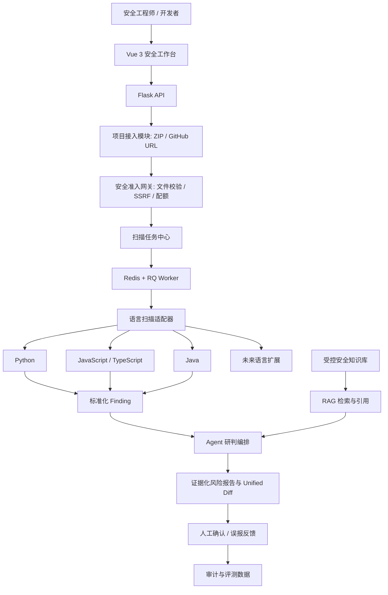
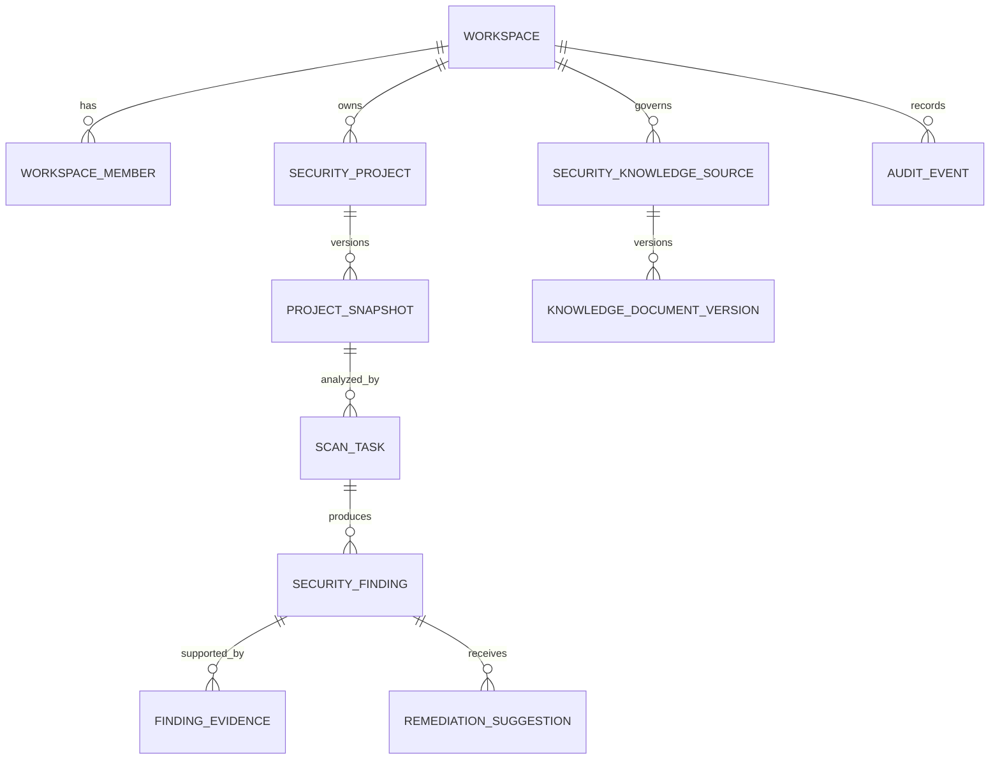

# CyberGuard 企业级 Agent + RAG 安全运营平台设计

- 日期：2026-07-19
- 状态：待用户审阅
- 范围：在现有 CyberGuard Flask + Vue + MySQL + ChromaDB 项目基础上，升级为可用于 GitHub 展示与简历陈述的企业级安全运营与 DevSecOps 平台。

## 1. 背景与目标

当前系统已经具备用户、角色、知识库、问答、向量检索、知识图谱和管理后台基础，但产品形态仍偏网络安全教学问答 Demo。目标是把它演进为一个受控、可审计、可扩展的安全工作台：用户提交 ZIP 项目包或公开 GitHub 仓库地址，平台对代码进行静态安全分析，结合安全知识库的 RAG 检索，由 Agent 生成有证据、有引用、可人工复核的研判和修复 Diff 建议。

### 1.1 成功标准

- 支持 ZIP 与公开 GitHub 仓库两种输入，统一为可复现的项目快照。
- 首期覆盖 Python、JavaScript/TypeScript、Java，并提供可注册的语言扫描插件契约。
- 提供 SAST、敏感信息、依赖风险（SCA）和基础配置风险四类确定性证据。
- Agent 只能基于扫描证据和受控 RAG 引用输出研判、优先级与 Unified Diff 建议。
- 支持工作区隔离、最小权限、任务状态机、审计日志、规则版本和质量指标。
- GitHub 仓库具备可复现启动、测试、演示样例、文档和 CI 证据链。

### 1.2 非目标

首期明确不支持：

- 执行、构建、测试、运行或容器化用户上传/拉取的项目代码。
- 自动修改项目文件、自动 Push、自动创建真实 Pull Request。
- 私有 GitHub 仓库和 OAuth Token 保管。
- 把 LLM 的自然语言结论当作唯一的漏洞发现依据。
- 承诺扫描发现全部漏洞；所有风险均应展示证据、置信度和人工复核提示。

## 2. 现状审计

### 2.1 可复用能力

- Flask API、JWT 身份认证、角色权限和 MySQL 持久化。
- 知识库、QA 历史、管理后台和文件处理基础。
- ChromaDB 持久化向量库、SecBERT 向量化、增强 RAG 和知识图谱融合。
- Vue 3、Pinia、Vue Router、Element Plus 和 ECharts 前端基础。

### 2.2 当前缺口

- 缺少工作区、项目、快照、扫描任务、Finding、证据、修复建议、规则版本和审计等领域模型。
- 缺少异步 Worker、任务资源限制、可取消状态机和部分失败处理。
- 当前上传面向知识文档，不具备 ZIP 防护、GitHub 输入白名单和 SSRF 防护。
- 当前本地 ChromaDB 没有安全知识来源版本、权限过滤、检索指标和生命周期治理。
- 当前配置中存在默认密钥和开放 CORS；发布前必须改为显式环境配置与受限源列表。
- 当前目录不是 Git 仓库，且没有完整测试、CI、部署和演示证据链。

## 3. 总体架构

采用“模块化单体 + Redis/RQ 异步 Worker”而非过早微服务化。Flask 保持 API、授权、业务编排和管理后台职责；Worker 专门执行静态扫描和 Agent 研判；MySQL 作为业务事实源；ChromaDB 作为安全知识检索后端。



### 3.1 组件职责

| 组件 | 职责 |
|---|---|
| 项目接入模块 | 接收 ZIP 或解析公开 GitHub URL，生成不可变项目快照。 |
| 安全准入网关 | 负责大小、类型、路径、重定向、SSRF、配额与来源校验。 |
| 扫描任务中心 | 创建、查询、取消、重试任务；持久化进度、状态和错误。 |
| RQ Worker | 在受限工作目录中执行只读静态扫描、结果规范化和 Agent 研判。 |
| 语言扫描器 | 识别技术栈、解析依赖、执行 SAST/SCA/配置扫描、规范化 Finding。 |
| Finding 中心 | 存储去重后的风险、证据、状态、规则版本和处置进度。 |
| Agent + RAG | 只融合证据和授权知识库，输出风险解释、引用和 Diff 草案。 |
| 报告与审计 | 展示趋势、导出报告、保留人工反馈和敏感操作轨迹。 |

## 4. 安全边界

### 4.1 代码不执行原则

扫描器只能读取文件、依赖清单和配置。不得运行用户项目的安装脚本、测试、构建、Hook、Submodule、Dockerfile 或任何用户提供的命令。Agent 不拥有 Shell、Git 写入、任意网络请求或文件写入能力。

### 4.2 ZIP 接入控制

- 默认压缩包最大 50 MB，解压总量最大 500 MB，文件数不超过 20,000；均配置化。
- 拒绝绝对路径、路径穿越、Windows 保留设备名、符号链接、硬链接和特殊文件。
- 仅保留可分析的文本源代码、依赖清单和安全配置；二进制文件跳过并记录原因。
- 每个扫描任务拥有独立且不可公开访问的工作目录。
- 任务完成后按数据保留策略清理原始快照；报告保留脱敏证据而非完整敏感值。

### 4.3 GitHub 接入控制

- 首期只支持公开的 `https://github.com/{owner}/{repo}`。
- 解析 owner/repo 后仅访问固定 GitHub 官方域名；不对用户输入执行通用 URL 抓取。
- 拒绝 IP、SSH、`file://`、自定义端口、非 GitHub 域名和任意重定向目标。
- 使用浅克隆或官方归档下载，禁用 Submodule、Git Hook 和 Git LFS 自动下载。
- 拉取阶段仍执行超时、大小、文件数、类型和内容哈希控制。

### 4.4 信息保护

- 密钥命中只保存掩码和哈希，不把完整凭据写入日志、前端、数据库或 Agent Prompt。
- 所有查询按 `workspace_id` 与成员权限过滤。
- 默认密钥、开放 CORS 和不安全环境缺省值必须在基础工程化阶段移除。

## 5. 数据模型

以工作区为企业数据隔离根节点。单机版自动创建默认工作区，团队版可直接扩展。



| 表 | 核心字段 | 目的 |
|---|---|---|
| `workspaces` | `name`, `slug`, `created_by` | 组织/团队数据隔离根。 |
| `workspace_members` | `workspace_id`, `user_id`, `role` | 工作区角色与授权。 |
| `security_projects` | `workspace_id`, `name`, `default_branch`, `created_by` | 逻辑项目与归属。 |
| `project_snapshots` | `project_id`, `source_type`, `source_ref`, `commit_sha`, `content_sha256`, `file_count`, `total_bytes` | 可复现扫描输入。 |
| `scan_tasks` | `snapshot_id`, `status`, `progress`, `policy_version`, `started_at`, `finished_at`, `error_code` | 状态机、进度、失败诊断。 |
| `security_findings` | `task_id`, `fingerprint`, `rule_id`, `category`, `severity`, `cwe_id`, `file_path`, `start_line`, `status` | 统一风险领域模型。 |
| `finding_evidences` | `finding_id`, `type`, `content_redacted`, `source_uri`, `line_range`, `score` | 规则、依赖、RAG 等原始证据。 |
| `remediation_suggestions` | `finding_id`, `rationale`, `patch_diff`, `confidence`, `model_version`, `prompt_version` | 人机协同修复建议。 |
| `scan_rule_versions` | `rule_id`, `language`, `engine`, `version`, `checksum`, `enabled` | 规则可追溯与治理。 |
| `audit_events` | `workspace_id`, `actor_id`, `action`, `target_type`, `target_id`, `metadata_json` | 敏感操作审计。 |

### 5.1 约束

- 所有领域查询须携带 `workspace_id`。
- Finding 指纹由规则、文件路径与规范化代码片段生成，用于跨扫描去重与风险趋势。
- 原始项目文件不作为静态资源暴露。
- `project_snapshot`、规则版本、模型版本和知识版本共同构成报告复现上下文。

## 6. 扫描插件架构

每种语言实现相同的 `LanguageScanner` 契约：

```text
LanguageScanner
├─ can_handle(snapshot) -> bool
├─ detect_project(snapshot) -> ProjectProfile
├─ collect_manifests(snapshot) -> DependencyManifest[]
├─ run_sast(snapshot, policy) -> RawFinding[]
├─ run_dependency_scan(manifests, policy) -> RawFinding[]
├─ run_config_scan(snapshot, policy) -> RawFinding[]
└─ normalize(raw_findings) -> Finding[]
```

### 6.1 首期扫描器

| 扫描器 | 项目识别 | 依赖输入 | 首期检测 |
|---|---|---|---|
| Python | `pyproject.toml`、`requirements*.txt`、`Pipfile` | requirements/lockfile | 命令注入、反序列化、弱加密、调试配置、依赖风险。 |
| JavaScript/TypeScript | `package.json`、`tsconfig.json` | npm/pnpm/yarn 锁文件 | XSS、危险 `eval`、原型污染、路径穿越、SSRF、依赖风险。 |
| Java | `pom.xml`、`build.gradle` | Maven/Gradle 依赖声明 | SQL 注入、表达式注入、路径穿越、不安全 XML、反序列化、依赖风险。 |

### 6.2 检测信号

1. **SAST**：多语言规则引擎承载通用与自定义规则，每项映射内部规则 ID 和可用 CWE。
2. **敏感信息**：检测密钥、私钥、数据库密码、Webhook Token、`.env` 和危险配置，但只保留掩码。
3. **SCA**：从依赖清单和锁文件获得组件、版本、CVE、修复版本、数据源更新时间和可达性状态。
4. **配置风险**：检测默认密码、调试模式、宽松 CORS、缺失安全 Header、Docker/CI 危险写法。

新增 Go、PHP、C# 等语言时仅增加扫描适配器和规则注册，不改变任务、Finding、报告或 Agent 主链路。

## 7. Agent 与 RAG 设计

### 7.1 ChromaDB 的定位

当前项目已经使用持久化 ChromaDB 和增强 RAG。首期继续复用其作为安全知识检索后端，不将向量检索用于直接猜测漏洞。向量库用于检索已授权的安全规范、CWE/CVE 说明、漏洞公告、修复手册和历史处置案例。

后续在不改变上层检索接口的前提下，可按规模切换到更适合多实例部署的向量后端。首期不把替换向量数据库作为阻塞项。

### 7.2 安全知识治理

安全知识需要具备来源、发布日期、版本、适用技术栈、有效期、工作区范围、标签和权限。检索时附加工作区和元数据过滤；报告中展示引用来源、文档版本和片段位置。

### 7.3 证据约束输出

Agent 每次只能获得：当前 Finding 的脱敏代码窗口、结构化扫描证据、项目技术栈/依赖上下文和授权 RAG 引用。它必须输出：

```text
风险结论 → 证据列表 → 利用条件 → 影响范围 → 修复建议
→ Unified Diff 草案 → 引用来源 → 置信度 → 人工复核提示
```

规则：

- 无规则、依赖、代码或知识引用证据时，不得将结论表述为已确认漏洞。
- 生成 Diff 前必须校验路径与原代码上下文；不匹配时拒绝生成补丁。
- 依赖风险必须区分可达风险和仅发现存在风险。
- Agent/RAG 故障时，任务进入 `COMPLETED_WITH_WARNINGS` 并保留原始扫描结果。

## 8. 扫描任务与权限

### 8.1 状态机

```text
CREATED → VALIDATING → FETCHING → SNAPSHOTTING → SCANNING → ANALYZING → COMPLETED
                   ↘ FAILED
任意进行中状态 → CANCELED
ANALYZING → COMPLETED_WITH_WARNINGS（Agent/RAG 不可用）
```

Flask 只创建、查询、取消或重试任务；Redis/RQ Worker 执行后台扫描。每一阶段更新进度、时间、错误码和审计事件。单个扫描引擎失败不得抹去已完成扫描结果。

### 8.2 工作区角色

| 角色 | 权限 |
|---|---|
| `owner` | 管理成员、项目、策略、数据保留和导出。 |
| `security_admin` | 管理规则、知识库、扫描、风险状态和报告。 |
| `analyst` | 发起扫描、查看全部 Finding、反馈误报、生成修复建议。 |
| `developer` | 在授权项目内发起扫描和处理 Finding。 |
| `viewer` | 只读已脱敏报告和证据。 |

只有 `owner` / `security_admin` 能修改规则、知识来源、模型配置和数据保留。导出报告、查看敏感证据和重新生成建议都必须写入审计日志。

## 9. 产品页面

1. 项目中心：上传 ZIP、导入 GitHub、项目列表、风险趋势和扫描状态。
2. 项目详情：项目快照、技术栈、扫描历史、风险分布、依赖清单。
3. 扫描任务详情：阶段进度、日志摘要、跳过文件、失败原因和重试。
4. Finding 列表：按等级、类型、语言、规则、CWE、状态、文件筛选，支持跨扫描去重。
5. Finding 详情：代码定位、脱敏证据、CWE/CVE、RAG 引用、Agent 研判、Unified Diff 和人工处置状态。
6. 安全知识库：来源、版本、有效期、适用范围和检索引用。
7. 规则与质量看板：规则版本、命中趋势、误报率、扫描耗时、引用覆盖率和建议采纳率。
8. 审计日志：按操作人、项目、时间和操作类型检索。

## 10. 创新点与评测

| 创新点 | 实现与指标 |
|---|---|
| 证据优先的 Agent 研判 | `evidence_coverage_rate`：带有效规则/代码/RAG 证据的结论占比。 |
| 风险链路关联 | 关联密钥泄露、开放配置、危险依赖、危险调用；统计高风险组合事件数。 |
| 可复现安全结论 | 固化快照、策略、规则、模型和知识版本；统计报告复现成功率。 |
| 人机协同修复 | 不自动应用 Diff，记录采纳/拒绝/误报；统计 `patch_acceptance_rate`。 |
| 安全知识时效治理 | 统计过期知识占比与有效知识引用占比。 |
| 多语言插件化 | 新语言只新增适配器与规则；验证不修改主任务链路。 |
| 可信降级 | LLM/RAG 故障下保留扫描结论；统计警告完成率和扫描可用性。 |

## 11. 分阶段实施

1. 基础工程化：Git 初始化、环境样例、安全配置、数据库迁移、测试骨架、审计基础。
2. 扫描闭环 MVP：ZIP、RQ、项目快照、三语言识别、基础 SAST/密钥/SCA/配置扫描、Finding 页面。
3. 可信 Agent + RAG：安全知识治理、引用约束、Diff、评测与反馈。
4. GitHub 与企业治理：公开仓库导入、SSRF 防护、权限细化、审计检索、规则版本与报告导出。
5. GitHub 完整交付：CI、单元/集成/E2E 测试、演示样例、基准评测、部署文档；容器化最后进行。

## 12. 验收与风险

### 12.1 最小验收

- 三类语言项目均能识别并生成快照。
- ZIP 路径穿越、过大解压、符号链接和非 GitHub URL 被拒绝并留痕。
- 任一扫描任务可查询进度、取消、失败诊断和重试。
- Finding 包含规则、文件位置、证据、等级、状态和去重指纹。
- Agent 建议包含引用和 Diff；无证据时不生成已确认漏洞结论。
- 跨工作区访问、未授权项目访问和敏感证据越权访问均被拒绝并有测试覆盖。
- GitHub README 能从安全样例仓库复现扫描、报告和评测展示。

### 12.2 已知风险与取舍

- 公开 GitHub 接入与私有仓库授权分期开启，首期避免令牌管理风险。
- 静态扫描不等价于实际可利用性验证；报告必须说明证据强度和人工复核要求。
- 多语言 SAST/SCA 引擎可能带来安装与运行成本；选型必须在实施前逐个验证许可证、离线能力、输出稳定性和 Windows 本地开发兼容性。
- 当前 ChromaDB 适合首期单机知识库；并发、多工作区规模增长后再评估替换后端。
- 现有项目不是 Git 仓库，尚未执行 Git 初始化或提交，避免在未明确要求时改变版本控制状态。
